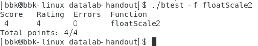
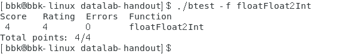
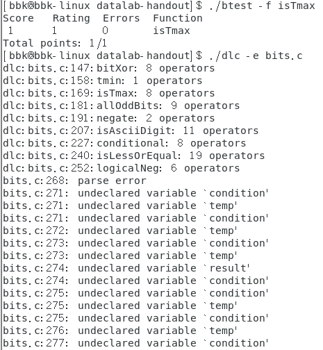

## Data Lab实验解答

### 1. 总体限制要求

> 注意：Data Lab实验需要用到CSAPP_3th第二章的内容，所以实验之前需要掌握第二章的各种知识。

这个实验中的每个题目都是一个函数，我们要根据规则来实现该函数，并返回正确的答案，每个题会测试很多示例来确定是否符合正确答案。

其中限制要求比较多，以下是实验的限制要求：

#### 1.1 语句限制要求

每个函数中只能含有一个或多个语句，其中所有的语句都不能为以下语句：
1. 除了题目所提供的以外，不能使用控制语句。
2. 不能定义和使用宏。
3. 不能在文件中定义和使用其他的函数。
4. 不能使用强制类型转换。
5. 不能使用题目所给之外的类型，比如数组，结构体等。

#### 1.2 表达式限制要求

只能包含以下的表达式：
1. 对于整型题目来说，只能使用值为0 - 255(`0xff`)的整型常量，不能用大的整型常量如`0xffffffff`；浮点题可以使用。
2. 自己定义的局部变量和函数形参，但不能有全局变量。
3. 只能包含运算符`=`和每一题所给的运算符。

### 2. 实验题目分析以及解答

本次实验一共13道题，整数题10道，浮点题3道。

#### 2.1 整数有关的题

##### 2.11 实现异或

**题目描述**

```c
/*
* bitXor - x^y using only ~ and &
*   Example: bitXor(4, 5) = 1
*   Legal ops: ~ &
*   Max ops: 14
*   Rating: 1
*/
int bitXor(int x, int y) 
{

}
```

**题目分析**

这道题让我们只使用位求反`~`以及位与`&`这两个运算符来实现位异或`^`运算符。

我们可以先列出位异或`^`运算符的真值表：
`x`|`y`|`x^y`
-|-|-
0|0|0
0|1|1
1|0|1
1|1|0

然后根据真值表写出异或表达式的[最小项之和](https://blog.csdn.net/qq_44431690/article/details/104587163)：
`(~x & y) | (x & ~y)`

再用[德摩根定律](https://baike.baidu.com/item/%E5%BE%B7%C2%B7%E6%91%A9%E6%A0%B9%E5%AE%9A%E5%BE%8B/489073)将`|`替换为`~`：
`~(~(x&~y)&~(~x&y))`

这样就得到了异或表达式的实现，所以答案为：
```c
int bitXor(int x, int y) 
{
    // 异或表达式的实现
    return ~(~(x&~y)&~(~x&y));
}
```


##### 2.12 实现有符号整数的最小值

**题目描述**

```c
/*
* tmin - return minimum two's complement integer
*   Legal ops: ! ~ & ^ | + << >>
*   Max ops: 4
*   Rating: 1
*/
int tmin(void) 
{

}
```

**题目分析**

这一道题就是让我们实现补码整数int型的最小值，我们根据[补码](https://baike.baidu.com/item/%E8%A1%A5%E7%A0%81)的性质以及int所占的位数大小(64位系统就是为32位)就能得到正确答案。

```c
int tmin(void) 
{
    // 将1移到最高位
    return 0x01 << 31;
}
```


##### 2.13 寻找有符号整数的最大值

**题目描述**

```c
/*
* isTmax - returns 1 if x is the maximum, two's complement number,
*          and 0 otherwise
*   Legal ops: ! ~ & ^ | +
*   Max ops: 10
*   Rating: 1
*/
int isTmax(int x) 
{

}
```

**题目分析**

这一道题让我们寻找到补码整数int型的最大值，并返回1。

我们可以根据异或的性质来比较两个值之间是否相同，也就是:
```c
// 等价于 x == y
!(x ^ y)
```

补码整数int型的最大值`0x7fffffff`有一个性质，就是`2x + 2`等于`0`，除了补码整数int型的`-1`也有这个性质之外，其他的数都没有这个性质。
因为补码整数int型`-1`加`1`可以等于`0`，所以我们可以通过使用异或`~`和位与`&`来判断所给的值是否为`-1`以及是否`2x+2`等于`0`。

所以正确答案为
```c
int isTmax(int x) 
{
    // 判断x是否为-1以及2x+2是否为0
    return !!(x + 1) & !((x + x + 2) ^ 0);
}
```


##### 2.14 寻找奇数位整数

**题目描述**

```c
/*
* allOddBits - return 1 if all odd-numbered bits in word set to 1
*              where bits are numbered from 0 (least significant) to 31 (most significant)
*   Examples allOddBits(0xFFFFFFFD) = 0, allOddBits(0xAAAAAAAA) = 1
*   Legal ops: ! ~ & ^ | + << >>
*   Max ops: 12
*   Rating: 2
*/
int allOddBits(int x) 
{

}
```

**题目分析**

这一道题让我们判断，如果一个int的二进制中，所有奇数位都为1，则返回1，否则为0。其中位数从0开始算。

同样，我们可以用异或让x与所有奇数位为1的数进行比较。

正确答案为
```c
int allOddBits(int x) 
{
    // all_odd为所有奇数位为1的数
    int all_odd = (0xaa << 24) + (0xaa << 16) + (0xaa << 8) + 0xaa;
    // x与all_odd进行比较
    return !((all_odd & x) ^ all_odd);
}
```


##### 2.15 实现相反数

**题目描述**

```c
/*
* negate - return -x
*   Example: negate(1) = -1.
*   Legal ops: ! ~ & ^ | + << >>
*   Max ops: 5
*   Rating: 2
*/
int negate(int x) 
{

}
```

**题目分析**

这一道题让我们不用负号来实现一个数的相反数。

补码整数的相反数实现方法一般是逐位取反，最后再加1，所以我们就可以这样操作。

正确答案为
```c
int negate(int x) 
{
    // 逐位取反，再加1
    return ~x+1;
}
```


##### 2.16 寻找'数字'

**题目描述**

```c
/*
* isAsciiDigit - return 1 if 0x30 <= x <= 0x39 (ASCII codes for characters '0' to '9')
*   Example: isAsciiDigit(0x35) = 1.
*            isAsciiDigit(0x3a) = 0.
*            isAsciiDigit(0x05) = 0.
*   Legal ops: ! ~ & ^ | + << >>
*   Max ops: 15
*   Rating: 3
*/
int isAsciiDigit(int x) 
{

}
```

**题目分析**

这一道题让我们判断一个整数的值是否是表示字符`'0'`到`'9'`之间的，如果是，则返回1；否则返回0。

我们通过观察字符`'0'`到`'9'`的十六进制式子可以发现：
* 它们的高24位都是相同的，都为`0x0000003X`。
* 它们的最低4位中，如果第四位为1，则二三位都会为0，也就是`100X`。

根据这两个性质，我们可以通过移位和位与运算符来提取这些位来进行操作，然后用异或进行比较，最后得出结果。

提取位的操作也就是用一个对应所要提取的位为1，其他位为0的数与该数进行位与，所得到的数就包含这些位的信息。
比如：
```c
// 目标串
// 需要提取该串的第16位到24位(从1开始算的位数)
int target = 0xaf3849de;
// 模式串
// 该串的第16位到24位为1，其他的都为0
int model = 0xff << 16;
// 结果
// result的十六进制为0x00380000
int result = target & model;
```

所以正确答案为
```c
int isAsciiDigit(int x) 
{
    // high_four_bits为x的第5位到第8位
    int high_four_bits = x >> 4;
    // low_first_bi为x的第4位
    int low_first_bit = x & 0x8;
    // low_three_bits为x的第2~4位
    int low_three_bits = (x >> 1) & 0x7;
    // 只有第9位到第32位都为0，第5位到第8位为0011，第2~4位为100或者0XX的数才是符号数
    return (!(high_four_bits ^ 0x3)) & ((!low_first_bit) | !(low_three_bits ^ 0x4));
}

// 另一种解法，使用条件运算
// int isAsciiDigit(int x) 
// {
//   int last_x = (x >> 31 & 1);
//   int last_a = (0x3a >> 31 & 1);
//   int condition = ~!(last_x ^ last_a) + 1;
//   int a_me_x = (condition & !((x + ~0x3a + 1) >> 31 & 1)) | ((~condition) & (last_x ^ 1));
//   return !((x >> 4) ^ 0x3) & !a_me_x;
// }
```


##### 2.17 实现条件运算

**题目描述**

```c
/*
* conditional - same as x ? y : z
*   Example: conditional(2,4,5) = 4
*   Legal ops: ! ~ & ^ | + << >>
*   Max ops: 16
*   Rating: 3
*/
int conditional(int x, int y, int z) 
{

}
```

**题目分析**

这一道题让我们只使用位运算相关的运算符来实现条件运算。

因为条件运算是一种分支控制结构，当条件成立执行某表达式，不成立则执行另一表达式。

所以条件运算的构造思路为：
1. 我们需要使用某种表达式来控制左右两个子表达式的成立，此时可以用到条件表达式。
   也就是条件成立时，一边原样输出，一边全为0；不成立时类似。
   此时我们可以想到十六进制串`0xffffffff`和`0x00000000`的性质，它们与其他值位与时，一个可以保持值不变，一个将值变为0，并且可以用位取反`~`来相互转换。
2. 根据上面的推理，我们还要连接两个子表达式，并且连接的符号不会影响输出，所以我们可以使用位或`|`来连接。
3. 接下来要构造条件表达式，使之能够变为`0xffffffff`和`0x0`。
   我们可以用逻辑非`！`来使式子变为`0x0`。

综上，我们就可以构造出条件运算了。

所以正确答案为
```c
int conditional(int x, int y, int z) 
{
   // condition为条件，判断x是否为非0
   int condition = ~!!x + 1;
   // 条件成立输出y，否则输出z
   return (condition & y) | ((~condition) & z);
}
```


##### 2.18 实现比较

**题目描述**

```c
/*
* isLessOrEqual - if x <= y  then return 1, else return 0
*   Example: isLessOrEqual(4,5) = 1.
*   Legal ops: ! ~ & ^ | + << >>
*   Max ops: 24
*   Rating: 3
*/
int isLessOrEqual(int x, int y) 
{

}
```

**题目分析**

这一道题让我们只使用位运算相关的运算符来实现比较运算符。

因为我们实现的是补码整数的比较运算符，所以有正负数之分。
通过观察数的大小以及正负可得出以下结论：
* 当两个数同号时：
  * 当大的数减去小的数时，所得结果都为正数，且都不会溢出。
  * 当小的数减去大的数时，所得结果都为负数，且都不会溢出。
* 当两个数异号时：
  正数肯定比负数大。

综上，我们需要知道两个数的正负，然后用条件运算进行同异号情况之间的判断。

所以正确答案为
```c
int isLessOrEqual(int x, int y) 
{
  // last_x为x的符号位
  int last_x = (x >> 31 & 1);
  // last_y为y的符号位
  int last_y = (y >> 31 & 1);
  // condition为条件，判断是否为同号
  int condition = ~!(last_x ^ last_y) + 1;
  // 同号则判断结果的符号位是否为0；异号则判断y的符号位是否为1
  return (condition & !((y + ~x + 1) >> 31 & 1)) | ((~condition) & (last_y ^ 1));
}
```


##### 2.19 实现逻辑非

**题目描述**

```c
/*
* logicalNeg - implement the ! operator, using all of
*              the legal operators except !
*   Examples: logicalNeg(3) = 0, logicalNeg(0) = 1
*   Legal ops: ~ & ^ | + << >>
*   Max ops: 12
*   Rating: 4
*/
int logicalNeg(int x) 
{

}
```

**题目分析**

这一道题让我们只使用位运算相关的运算符来实现逻辑非运算符。

我们通过观察0和其他非0的数可以发现：
* 对于0来说，它的相反数的最高位总是为0。
* 对于大多数非0的数来说，其相反数的最高位与该数相反；只有补码整数的最小值的相反数与其相同，且最高位都为1。
* 对int型进行右移时，如果最高位为1，则左边添加的位的值为1，否则为0。

根据以上的性质，我们可以考虑将数或者其相反数进行右移，如果右移后的值为`0xffffffff`，则是为非0的数，如果右移后的值是`0`，则是0。

所以正确答案为
```c
int logicalNeg(int x) 
{
  // 当数为非0时，经过两次移位的结果后都会变为0xffffffff，再加1就为0；
  // 当数为0时，一直都为0，加1就为1
  return ((x | ((~x + 1) >> 31)) >> 31) + 1;
}
```


##### 2.110 查询最少位

**题目描述**

```c
/* howManyBits - return the minimum number of bits required to represent x in
*                two's complement
*  Examples: howManyBits(12) = 5
*            howManyBits(298) = 10
*            howManyBits(-5) = 4
*            howManyBits(0)  = 1
*            howManyBits(-1) = 1
*            howManyBits(0x80000000) = 32
*  Legal ops: ! ~ & ^ | + << >>
*  Max ops: 90
*  Rating: 4
*/
int howManyBits(int x) 
{

}
```

**题目分析**

这一道题让我们通过所给的数，判断该数最少所需要的位数。

我们通过观察整数的二进制可以发现：
* 对于正数来说，我们判断该数所需的最少位的方法为：
  从左到右找到该数二进制中的第一个为1的值的位，此位所在的位数(从1开始算)加上符号位(因为是补码整数)就是该数所需的最少位数。
* 对于负数来说，我们判断该数所需的最少位的方法和正数类似，只不过要找到第一个为0的值的位。

根据以上的性质，我们可以考虑使用逐位或者二分法进行查找。
本题的最大可用操作符数量为90，这也证明可以逐位查找，不过因为int有32位，逐位查找太麻烦，所以我们就用二分法进行查找。

进行二分法之前，我们为了方便进行查找，可以将负数的值按位取反，使之也是通过寻找第一个为1的值的位来判断的。

二分法的思路为：
1. 每次将所给数的二进制位分为两部分，判断某一部分是否含有值为1的位。
2. 如果含有，则所需位数至少为该部分的位数，否则还需进一步判断。
3. 然后进入含有值为1的位的那个部分，再次进行查找操作，直至找到第一个为1的值的位或者所给的数没有值为1的位，则就得到了最终的结果。

所以正确答案为
```c
int howManyBits(int x) 
{
   // flag为x的符号位
   int flag = x >> 31;
   // 当x为负数，则将其按位取反；否则不变
   x = (~flag & x)|(flag & ~x);
   // 从中间进行二分，并检查左边的部分
   int temp = x >> 16;
   // 条件condition，判断左边是否含有值为1的位
   int condition = ~!!temp + 1;
   // result储存结果，判断有则加上该部分的位数。
   int result = condition & 16;
   // 根据条件condition决定那一部分为含有值的部分，然后进入该部分再此进行查找。
   x = (condition & temp) | ((~condition) & x);

   // 重复以上的部分。
   temp = x >> 8;
   condition = ~!!temp + 1;
   result += condition & 8;
   x = (condition & temp) | ((~condition) & x);
   temp = x >> 4;
   condition = ~!!temp + 1;
   result += condition & 4;
   x = (condition & temp) | ((~condition) & x);
   temp = x >> 2;
   condition = ~!!temp + 1;
   result += condition & 2;
   x = (condition & temp) | ((~condition) & x);
   temp = x >> 1;
   condition = ~!!temp + 1;
   result += condition & 1;

   // 最终找到该值，或者所给数不存在值为1的位。
   // 不存在，则x为0，否则为1。
   x = (condition & temp) | ((~condition) & x);
   // 最终结果，不要忘记加符号位。
   return result + 1 + x;
}
```


#### 2.2 浮点数有关的题

##### 2.21 浮点数乘二

**题目描述**

```c
/*
* floatScale2 - Return bit-level equivalent of expression 2*f for
*               floating point argument f.
*               Both the argument and result are passed as unsigned int's, but
*               they are to be interpreted as the bit-level representation of
*               single-precision floating point values.
*               When argument is NaN, return argument
*   Legal ops: Any integer/unsigned operations incl. ||, &&. also if, while
*   Max ops: 30
*   Rating: 4
*/
unsigned floatScale2(unsigned uf) 
{

}
```

**题目分析**

这一道题让我们将所给的无符号整数的二进制位当做是float浮点数的二进制位，并对该浮点数乘二，返回乘二后的二进制位。如果该浮点数为无穷或者`NAN`，则直接返回该值。

我们所用的浮点数标准大部分为[IEEE标准754](https://baike.baidu.com/item/IEEE%20754/3869922)。
该标准对于浮点数与整数的乘积结果，有以下特点：
1. 如果浮点数为规格化数：
   则对浮点数的乘积就是对阶码编码值的改变。
2. 如果浮点数为非规格化数：
   则对浮点数的乘积就是对尾数的乘积(也可以看做把尾数整体往左或者右移动)。
3. 如果浮点数为特殊值(也就是阶码位全为1)：
   则对该浮点数进行的乘积对其没有作用。

根据以上的性质，我们可以先提取出浮点数的符号位和阶码位，然后根据阶码编码值进行不同的操作。

所以正确答案为
```c
unsigned floatScale2(unsigned uf) 
{
    // 提取符号位
    unsigned sign = uf & (1 << 31);
    // 提取阶码位
    unsigned exponent = uf & (0xff << 23);
    // 当浮点数为特殊值的情况
    if (exponent == (0xff << 23))
        return(uf);
    // 当浮点数为非规格化数的情况
    else if (exponent == 0)
        return(sign + uf + uf);
    // 当浮点数为规格化数的情况
    else
        return(uf + (0x1 << 23));
}
```



##### 2.22 浮点数转换成有符号整数

**题目描述**

```c
/*
* floatFloat2Int - Return bit-level equivalent of expression (int) f
*                  for floating point argument f.
*                  Argument is passed as unsigned int, but
*                  it is to be interpreted as the bit-level representation of a
*                  single-precision floating point value.
*                  Anything out of range (including NaN and infinity) should return
*                  0x80000000u.
*   Legal ops: Any integer/unsigned operations incl. ||, &&. also if, while
*   Max ops: 30
*   Rating: 4
*/
int floatFloat2Int(unsigned uf) 
{

}
```

**题目分析**

这一道题让我们将所给的无符号整数的二进制位当做是float浮点数的二进制位，并对该浮点数进行类型转换，将其转换成int型整数。如果该浮点数超出了范围(包括为无穷或者`NAN`)，则返回`0x80000000u`。

对于规格化浮点数转换为整数，我们通常是以以下的流程进行转换的：
1. 算出阶码的编码值，并减去偏置值，从左到右按照此值将对应数量的尾数记录下来，这些数就是整数的大部分有效位。
2. 再在这些数的最前面加上值为1的位，然后在开头加上多个0，直至已经达到32位。
3. 如果符号位为1，则需要将该整数转换为其相反数(按位取反再加1)；否则整数的转换就已经完成。

IEEE标准754对于浮点数转换为整数，有以下的特点：
1. 如果浮点数的阶码值(进行偏置处理后)小于0或者浮点数为非规格化数时：
   则转换后的整数就为0。
2. 如果浮点数的阶码值(进行偏置处理后)大于31或者阶码位全为1时：
   则转换后的整数就为`0x80000000`。

根据以上的性质，我们可以先提取出浮点数的符号位、阶码位和尾数位，然后根据阶码值(进行偏置处理后)进行不同的操作。

所以正确答案为
```c
int floatFloat2Int(unsigned uf) 
{
   // 提取符号位，并放在末尾
   unsigned sign = (uf >> 31) & 1;
   // 提取阶码位，并放在末尾
   unsigned exponent = (uf >> 23) & 0xff;
   // 提取尾数位
   unsigned frac = uf & ((0x7f << 16) + (0xff << 8) + 0xff);
   // 阶码值(进行偏置处理后)
   int exponent_val = exponent + ~127 + 1;
   // 规格化浮点数变为整数的正常转换
   int result = (1 << exponent_val) + (frac >> (23 + ~exponent_val + 1));
   // 当阶码值(进行偏置处理后)大于31或者阶码位全为1的情况
   if (exponent_val > 31)
   return(0x80000000u);
   // 当阶码值(进行偏置处理后)小于0小于0或者为非规格化数的情况
   else if (exponent_val < 0)
   return(0);
   // 当符号位为0的情况
   else if (sign ^ 1)
   return result;
   // 当符号位为1的情况
   else
   return ~result + 1;
}
```



##### 2.23 2的指数形式的浮点数

**题目描述**

```c
/*
* floatPower2 - Return bit-level equivalent of the expression 2.0^x
*   (2.0 raised to the power x) for any 32-bit integer x.
*
*   The unsigned value that is returned should have the identical bit
*   representation as the single-precision floating-point number 2.0^x.
*   If the result is too small to be represented as a denorm, return
*   0. If too large, return +INF.
*
*   Legal ops: Any integer/unsigned operations incl. ||, &&. Also if, while
*   Max ops: 30
*   Rating: 4
*/
unsigned floatPower2(int x) 
{

}
```

**题目分析**

这一道题让我们将所给的补码整数当做以2为底的指数，并将这个2的幂转换为浮点数的形式。

IEEE标准754对于2的幂转换为浮点数，有以下的特点：
1. 如果该2次幂的指数在规格化范围内(大于等于-126，小于等于127)：
   则转换后的浮点数为：
   * 符号位为0。
   * 阶码编码值为偏置值加上该指数。
   * 尾数位全为0。
2. 如果该2次幂的指数在非规格化范围内（大于等于-149(因为最小的非规格化数为$2^{-23}\times2^{-126}$)，小于等于-126）：
   则转换后的浮点数为：
   * 符号位为0。
   * 阶码位全为0。
   * 尾数位有且只有一位的值为1的位(当指数为-126时可以没有)，该位的编号(从尾数位的最左到右，从1开始计算)为$该幂的指数-126$，其余全为0。
3. 如果该2次幂的指数大于127，则浮点数为阶码位全为1的特殊值；小于-149时，浮点数为0。

根据以上的性质，我们可以直接根据所给的指数值进行不同的操作。

所以正确答案为
```c
unsigned floatPower2(int x)
{
   // 指数大于127的情况
   if (x > 127) return 0xff << 23;
   // 指数小于-149的情况
   else if (x < -149) return 0;
   // 指数在规格数范围的情况
   else if (x >= -126) return (x + 127) << 23;
   // 指数在非规格数范围的情况
   else return 1 << (23 + x + 126);
}
```

> 很遗憾，这个题目floatPower2始终无法通过，一直提示死循环。不过不是逻辑上的错误，在VS2019和vscode上完全可以运行，没有进入死循环。所以应该是该实验自带的计分程序的bug。


### 3. 总结

本次实验中的各个题目的操作符使用情况：



> 不知道为什么，语法检查程序一直显示howManyBits题中我使用了未声明的变量，但是我明明声明了，而且在VS2019和vscode上完全没有错误，所以应该又是一个该实验自带的语法检查程序中的bug。

本次实验的最终得分：


这是我第一次做CSAPP上的实验题，感觉本次实验的题目的难度比较大，加上还有各种语句、表达式和操作符数量的限制，所以整体难度我估计是leetcode上的困难题。
再加上因为都是涉及位运算的，之前刷的题也没有涉及太多这方面的题型，所以花了不少时间。

希望能坚持下来，继续完成后面的实验，加油！

