## Bomb Lab实验解答

### 1.实验概述

> 注意：Data Lab实验需要用到CSAPP_3th第三章的内容，所以实验之前需要掌握第三章的各种知识。

这次的Bomb Lab实验非常有趣，实验内容是让我们扮演拆弹专家，破解邪恶博士留下来的炸弹的密码。
这个炸弹有6层密码保护，我们需要逐层输入所有的正确密码才能拆除炸弹，否则炸弹就会爆炸。

这个炸弹是一个x86-64的可执行文件，本次实验其实就是让我们使用逆向工程分析这个文件并破解其中所含的6个密码。
所以，为了完成这次实验，我们需要熟悉ATT格式汇编的基本语法，并会使用反汇编工具以及调试器。

### 2.实验准备

本次实验所提供的是linux系统的x86-64的ATT格式的可执行文件，名称为`bomb`。
所以，我们需要用linux系统x86-64环境来操作实验。

我的linux系统是CentOS7.9，使用的反汇编工具是objdump，调试器是gdb。
以下是基于上面的环境以及工具进行操作的。

打开linux的命令行终端，进入文件所在的目录下，开始进行逆向工程破解：
1. 进行反汇编：
   在命令行输入`objdump -d bomb`，此时终端会输出该文件的所有反编译后的代码，我们之后的分析就是基于这些汇编代码进行的。
   我们可以将这些代码复制到某个新建的文本文件中，方便之后的查找与标记。
   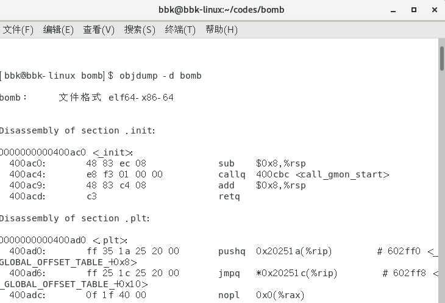
2. 进入调试：
   我们打开一个新的命令行终端并进入文件所在的目录下，在命令行输入`gdb bomb`，此时进入该文件的调试操作，我们之后的各种实验调试都是在这上面进行的。
   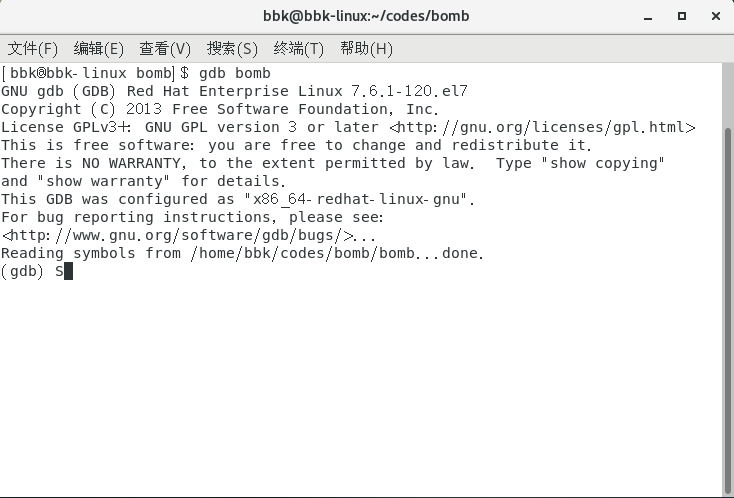
    以下是csapp一书提供的一些gdb调试器的操作：
   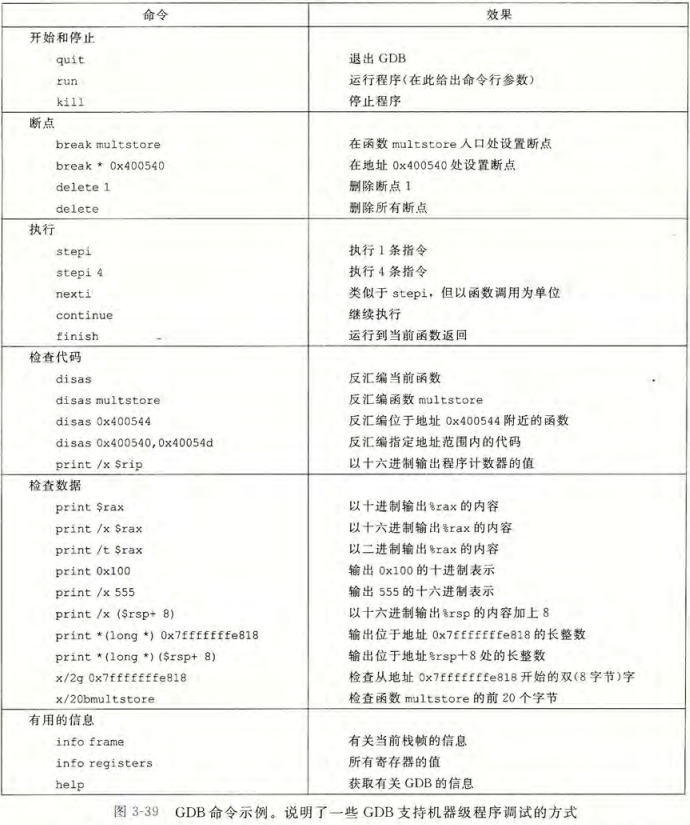
3. 开始破解：
   该程序是让我们用键盘来输入密码的，每层的密码是嵌套的，只有破解了外层的密码，才能进行下一层密码的破解。
   所以接下来我会按照从外到内的顺序，逐个分析并破解这6个密码。

### 3.进行破解

我们开始进行破解的工作，对于破解工作，我们要明白以下几点：
* 反汇编出来的汇编代码是我们关注的重点：
  汇编代码通常很多，我们不是要全都看懂，要学会在这些汇编代码中找到我们所需要的信息。
* 当我们对某些汇编代码看不懂，或者代码中使用了一些汇编代码中没有标识的地址时，可以使用调试器对程序进行调试来获取和分析这些信息。
* 分析汇编代码时，我们需要清楚某种形式的汇编代码在c语言中所对应的格式是什么，也就是要学会将汇编代码翻译成对应的高级语言：
  * 要清楚高级语言所用的编译器将高级语言转换成汇编代码的常见形式，如判断语句，循环语句，数组等语句和结构的转换形式。
  * 要会根据寄存器的名称来推测指令的操作对象的尺寸或者创建的变量的尺寸。
  * 要会根据寄存器的名称来推测函数的形参个数与类型。

以下是汇编中的整数寄存器的表：
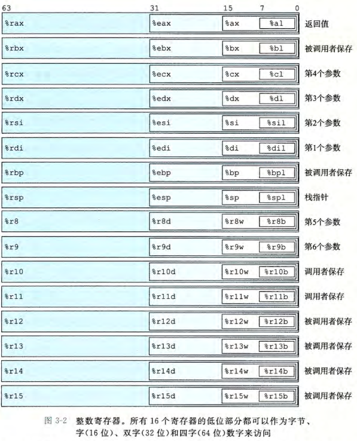

---

破解之前，我们可以运行一下该程序，试一试这个程序是什么样的。
以下是程序开始时的命令行提示：
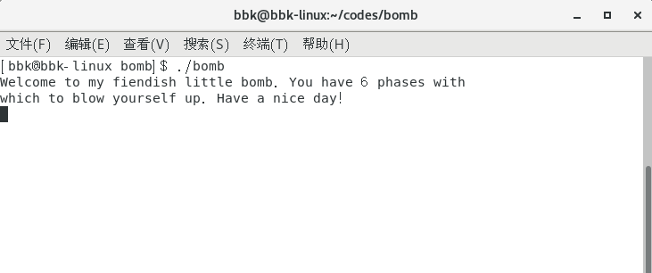

我们可以随便输入一些字符，观察一下是什么结果：
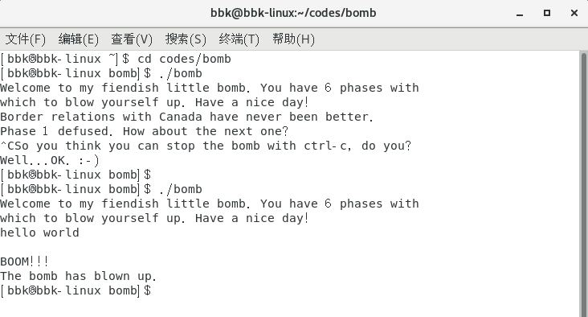

结果是提示炸弹已爆炸，程序也终止了，看来我们必须要输入正确的密码才能解除炸弹。

以下就是各关的密码攻略：

#### 3.1 第一关

我们先快速浏览一下反汇编后的代码，看一看有没有什么对应每个密码的函数什么的。

经我们观察后，发现汇编代码中存在多个类似`phase_x`的函数名称，并且在`main`函数代码内也能看到对这些函数的调用指令。
我们可以初步判断这些函数就是用来判断对应密码是否正确的函数。
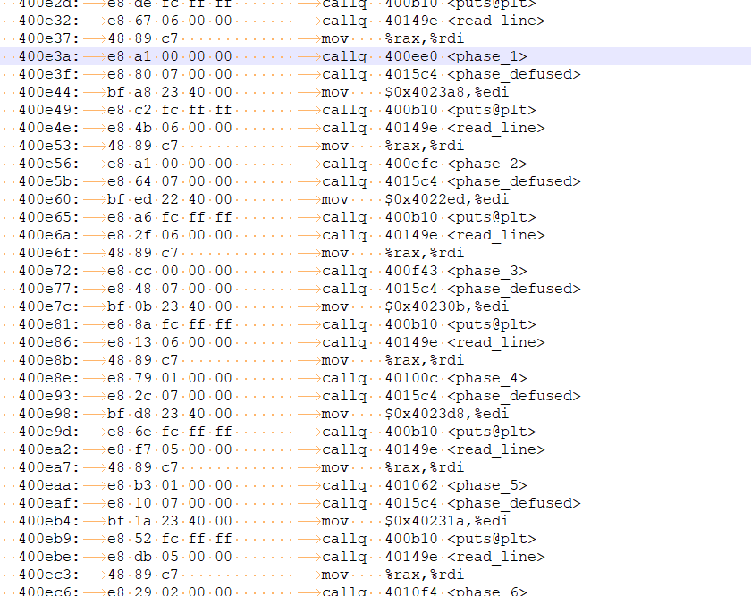
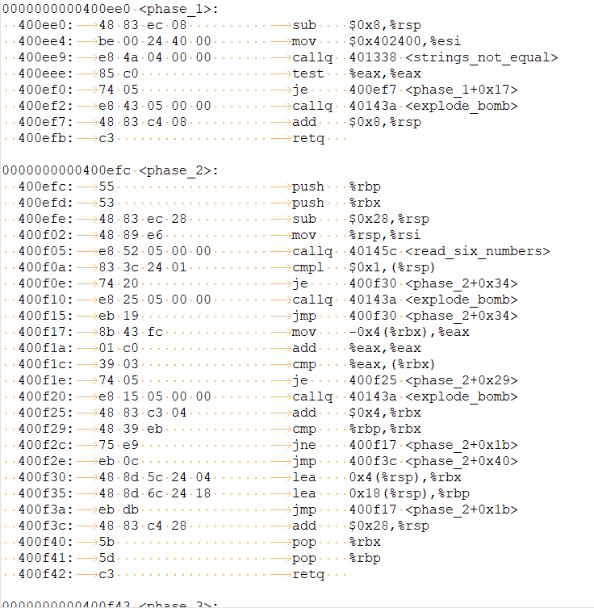

于是我们找到名为`phase_1`的函数，对其进行分析。
```bash
0000000000400ee0 <phase_1>:
  400ee0:	48 83 ec 08          	sub    $0x8,%rsp
  400ee4:	be 00 24 40 00       	mov    $0x402400,%esi
  400ee9:	e8 4a 04 00 00       	callq  401338 <strings_not_equal>
  400eee:	85 c0                	test   %eax,%eax
  400ef0:	74 05                	je     400ef7 <phase_1+0x17>
  400ef2:	e8 43 05 00 00       	callq  40143a <explode_bomb>
  400ef7:	48 83 c4 08          	add    $0x8,%rsp
  400efb:	c3                   	retq   
```

我们发现这个函数中调用了两个其他的函数，一个名为`strings_not_equal`，一个名为`explode_bomb`，通过这两个函数的名字，我们初步判断一个是用来判断字符串长度的，一个是触发炸弹爆炸的。
```bash
0000000000401338 <strings_not_equal>:
  401338:	41 54                	push   %r12
  40133a:	55                   	push   %rbp
  40133b:	53                   	push   %rbx
  40133c:	48 89 fb             	mov    %rdi,%rbx
  40133f:	48 89 f5             	mov    %rsi,%rbp
  401342:	e8 d4 ff ff ff       	callq  40131b <string_length>
  401347:	41 89 c4             	mov    %eax,%r12d
  40134a:	48 89 ef             	mov    %rbp,%rdi
  40134d:	e8 c9 ff ff ff       	callq  40131b <string_length>
  401352:	ba 01 00 00 00       	mov    $0x1,%edx
  401357:	41 39 c4             	cmp    %eax,%r12d
  40135a:	75 3f                	jne    40139b <strings_not_equal+0x63>
  40135c:	0f b6 03             	movzbl (%rbx),%eax
  40135f:	84 c0                	test   %al,%al
  401361:	74 25                	je     401388 <strings_not_equal+0x50>
  401363:	3a 45 00             	cmp    0x0(%rbp),%al
  401366:	74 0a                	je     401372 <strings_not_equal+0x3a> #point
  401368:	eb 25                	jmp    40138f <strings_not_equal+0x57>
  40136a:	3a 45 00             	cmp    0x0(%rbp),%al
  40136d:	0f 1f 00             	nopl   (%rax)
  401370:	75 24                	jne    401396 <strings_not_equal+0x5e>
  401372:	48 83 c3 01          	add    $0x1,%rbx
  401376:	48 83 c5 01          	add    $0x1,%rbp
  40137a:	0f b6 03             	movzbl (%rbx),%eax
  40137d:	84 c0                	test   %al,%al
  40137f:	75 e9                	jne    40136a <strings_not_equal+0x32>
  401381:	ba 00 00 00 00       	mov    $0x0,%edx
  401386:	eb 13                	jmp    40139b <strings_not_equal+0x63>
  401388:	ba 00 00 00 00       	mov    $0x0,%edx
  40138d:	eb 0c                	jmp    40139b <strings_not_equal+0x63>
  40138f:	ba 01 00 00 00       	mov    $0x1,%edx
  401394:	eb 05                	jmp    40139b <strings_not_equal+0x63>
  401396:	ba 01 00 00 00       	mov    $0x1,%edx
  40139b:	89 d0                	mov    %edx,%eax
  40139d:	5b                   	pop    %rbx
  40139e:	5d                   	pop    %rbp
  40139f:	41 5c                	pop    %r12
  4013a1:	c3                   	retq   
```

```bash
000000000040143a <explode_bomb>:
  40143a:	48 83 ec 08          	sub    $0x8,%rsp
  40143e:	bf a3 25 40 00       	mov    $0x4025a3,%edi
  401443:	e8 c8 f6 ff ff       	callq  400b10 <puts@plt>
  401448:	bf ac 25 40 00       	mov    $0x4025ac,%edi
  40144d:	e8 be f6 ff ff       	callq  400b10 <puts@plt>
  401452:	bf 08 00 00 00       	mov    $0x8,%edi
  401457:	e8 c4 f7 ff ff       	callq  400c20 <exit@plt>
```

##### 3.11 string_length函数

经过分析`strings_not_equal`函数的代码，我们发现该函数内调用了名为`string_length`的函数。

对其分析，发现这个函数应该只有一个形参，且作用是给出所给字符串的长度：
```bash
000000000040131b <string_length>:
  40131b:	80 3f 00             	cmpb   $0x0,(%rdi)
  40131e:	74 12                	je     401332 <string_length+0x17>
  401320:	48 89 fa             	mov    %rdi,%rdx
  401323:	48 83 c2 01          	add    $0x1,%rdx
  401327:	89 d0                	mov    %edx,%eax
  401329:	29 f8                	sub    %edi,%eax
  40132b:	80 3a 00             	cmpb   $0x0,(%rdx)
  40132e:	75 f3                	jne    401323 <string_length+0x8>
  401330:	f3 c3                	repz retq 
  401332:	b8 00 00 00 00       	mov    $0x0,%eax
  401337:	c3                   	retq   
```
所以`string_length`函数对应的C语言代码应该为：
```c
int string_length(char *str)
{
    // 当字符串为空时返回0
    if (*str == '\0') 
        return 0;
    // 当字符串不为空时，返回该字符串的字符数量(不包括空字符)
    else
    {
        char *inc = str;
        do
            inc += 1;
        while (*inc != '\0');
        return inc - str;
    }
}
```

##### 3.12 strings_not_equal函数

经过分析`strings_not_equal`函数的代码，我们可以发现该函数应该含有两个形参，且该函数的作用是判断两个字符串是否相等。

所以`strings_not_equal`函数对应的C语言代码应该为：
```c
int strings_not_equal(char *str, char* code_str)
{
    // 计算两个字符串的长度
    int decode_str_len = string_length(str);
    int code_str_len= string_length(code_str);
    // 长度不相等返回1
    if (decode_str_len != code_str_len) 
        return 1;
    // 密码为空时返回0
    if (*str == '\0') 
        return 0;
    // 两个字符串必须要相等才返回0，否则返回1
    else if (*str == *code_str)
    {
        char *temp_dec = str;
        char *temp_cod = code_str;
        do
        {
            temp_dec += 1;
            temp_cod += 1;
        }
        while (*temp_dec != '\0' && *temp_dec == *temp_cod);
        if (*temp_dec == '\0') 
            return 0;
        else 
            return 1;
    }
    else 
        return 1;
}
```

##### 3.13 phase_1函数

经过分析`phase_1`的代码，我们可以发现`phase_1`函数通过调用`strings_not_equal`函数，用该函数的返回值来决定是否触发炸弹。

`phase_1`函数调用`strings_not_equal`函数的第一个实参应该是我们所输入的密码字符串；第二个实参应该是这一关的真正密码字符串，不过汇编代码只有该字符串的一个起始内存地址，所以我们需要使用调试器来探查这个内存地址所存的字符串是什么：
1. 我们在调试模式里输入`print/c *0x402400`来查询这个地址所对应的字符是什么，此时终端应该出现了该地址所含的字符。
2. 接下来将从低地址到高地址逐个重复之前的指令，直到终端出现了字符`\0`，这些字符所组成的字符串就是这一关的密码。
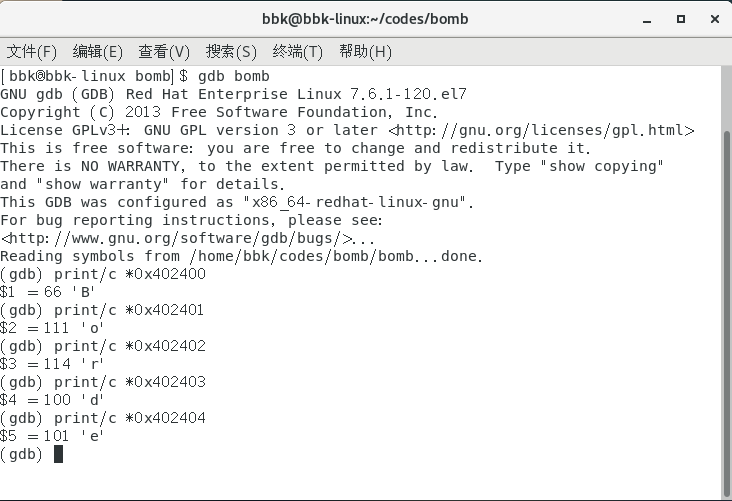

所以`phase_1`和`explode_bomb`函数对应的C语言代码应该为：
```c
void explode_bomb()
{
    printf("BOOM!!!\n"); 
    printf("The bomb has blown up.\n"); 
    exit(1);
}
void phase_1(char *str)
{
    // 真正的密码
    // *0x402400
    char codes[] = "Border relations with Canada have never been better.";
    // 密码不相等就触发炸弹
    if (strings_not_equal(str, codes))
        explode_bomb();
}
```

##### 3.14 第一关密码

综上，第一关的密码为
`Border relations with Canada have never been better.`

以下是通过第一关的提示：
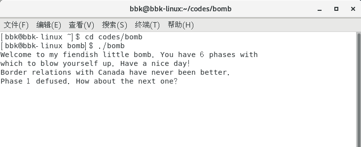

#### 3.2 第二关

因为我们可能需要多次运行该程序，所以为了减少不必要的输入，该程序支持我们将之前所解的密码写入到某个新建的文本文件中，并在运行该程序时提供该文件的路径，这样就不用每次运行时都要重新输入之前的密码了。

以下是提供密码的运行操作(密码放在该程序同目录的`enc`文本文件中)：
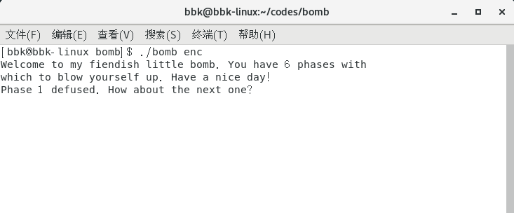
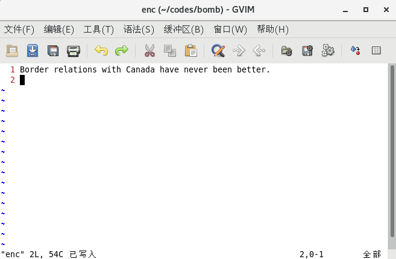

---

和第一关一样，我们对`phase_2`函数进行分析，发现其中调用了一个名为`read_six_numbers`的函数，听名字应该是读取6个数字的。

##### 3.21 read_six_numbers函数

于是我们找到名为`read_six_numbers`的函数进行分析：
```bash
000000000040145c <read_six_numbers>:
  40145c:	48 83 ec 18          	sub    $0x18,%rsp
  401460:	48 89 f2             	mov    %rsi,%rdx
  401463:	48 8d 4e 04          	lea    0x4(%rsi),%rcx
  401467:	48 8d 46 14          	lea    0x14(%rsi),%rax
  40146b:	48 89 44 24 08       	mov    %rax,0x8(%rsp)
  401470:	48 8d 46 10          	lea    0x10(%rsi),%rax
  401474:	48 89 04 24          	mov    %rax,(%rsp)
  401478:	4c 8d 4e 0c          	lea    0xc(%rsi),%r9
  40147c:	4c 8d 46 08          	lea    0x8(%rsi),%r8
  401480:	be c3 25 40 00       	mov    $0x4025c3,%esi
  401485:	b8 00 00 00 00       	mov    $0x0,%eax
  40148a:	e8 61 f7 ff ff       	callq  400bf0 <__isoc99_sscanf@plt>
  40148f:	83 f8 05             	cmp    $0x5,%eax
  401492:	7f 05                	jg     401499 <read_six_numbers+0x3d>
  401494:	e8 a1 ff ff ff       	callq  40143a <explode_bomb>
  401499:	48 83 c4 18          	add    $0x18,%rsp
  40149d:	c3                   	retq     
```

对其分析，发现这个函数调用`sscanf`函数进行读取，且判断其应该有两个形参，一个形参为字符指针，用于读取；另一个形参为int型指针，该指针指向一个int数组，用于将读取的值写入到该int数组中。

观察该函数以及其名字，应该是要写入6个值到变量中，但是汇编中的`sscanf`函数中的格式字符串只有一个起始地址，所以我们必须要用调试器查清到底该传什么类型的值。
和之前一样，输入对应指令就能知道该字符串所对应的字符。
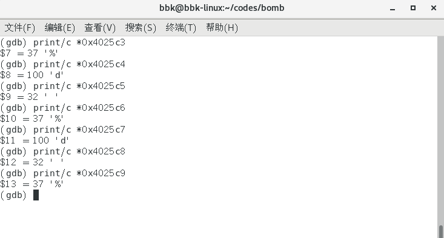

所以`read_six_numbers`函数对应的C语言代码应该为：
```c
void read_six_numbers(char* str, int *top) 
{
    // 储存int指针的数组
    int *int_ptrs[3];
    // 传入的int指针，指向int数组的最后一个元素。
    // 第1个写入
    int *rd = top;
    // 第2个写入
    int *rc = top - 1;
    // 第6个写入
    int_ptrs[1] = top - 5;
    // 第5个写入
    int_ptrs[2] = top - 4;
    // 第4个写入
    int *r9 = top - 3;
    // 第3个写入
    int *r8 = top - 2;
    // 格式字符串
    // *0x4025c3
    char* formats = "%d %d %d %d %d %d"; 
    // 当读取的匹配格式的字符数量小于6时，触发炸弹
    if (sscanf(str, formats, rd, rc, r8, r9, int_ptrs[2], int_ptrs[1]) <= 5)
        explode_bomb();
}
```

##### 3.22 phase_2函数

经过分析`phase_2`的代码，我们发现`phase_2`函数先调用`read_six_numbers`函数来读取6个整数，然后用这些值来决定是否触发炸弹。
```bash
0000000000400efc <phase_2>:
  400efc:	55                   	push   %rbp
  400efd:	53                   	push   %rbx
  400efe:	48 83 ec 28          	sub    $0x28,%rsp
  400f02:	48 89 e6             	mov    %rsp,%rsi
  400f05:	e8 52 05 00 00       	callq  40145c <read_six_numbers>
  400f0a:	83 3c 24 01          	cmpl   $0x1,(%rsp)
  400f0e:	74 20                	je     400f30 <phase_2+0x34>
  400f10:	e8 25 05 00 00       	callq  40143a <explode_bomb>
  400f15:	eb 19                	jmp    400f30 <phase_2+0x34>
  400f17:	8b 43 fc             	mov    -0x4(%rbx),%eax
  400f1a:	01 c0                	add    %eax,%eax
  400f1c:	39 03                	cmp    %eax,(%rbx)
  400f1e:	74 05                	je     400f25 <phase_2+0x29>
  400f20:	e8 15 05 00 00       	callq  40143a <explode_bomb>
  400f25:	48 83 c3 04          	add    $0x4,%rbx
  400f29:	48 39 eb             	cmp    %rbp,%rbx
  400f2c:	75 e9                	jne    400f17 <phase_2+0x1b>
  400f2e:	eb 0c                	jmp    400f3c <phase_2+0x40>
  400f30:	48 8d 5c 24 04       	lea    0x4(%rsp),%rbx
  400f35:	48 8d 6c 24 18       	lea    0x18(%rsp),%rbp
  400f3a:	eb db                	jmp    400f17 <phase_2+0x1b>
  400f3c:	48 83 c4 28          	add    $0x28,%rsp
  400f40:	5b                   	pop    %rbx
  400f41:	5d                   	pop    %rbp
  400f42:	c3                   	retq   
```

所以`phase_2`函数对应的C语言代码应该为：
```c
void phase_2(char *str)
{
    // 储存所读取的值
    int int_vals[10];
    int *top = &int_vals[9];
    // 进行读取
    read_six_numbers(str, top);
    // 第一个读取的值必须为1，且后一个读取的值必须
    // 为前一个值的2倍，否则触发炸弹
    // 也就是首项为1，公比为1/2的等比数列
    if (*top == 1)
    {
        int* iter_ptr = top - 1;
        do
            if (*iter_ptr == *(iter_ptr + 1)*2)
                iter_ptr -= 1;
            else
                explode_bomb();
        while (iter_ptr != top - 6);
    }
    else explode_bomb();
}
```

##### 3.23 第二关密码

综上，第二关的密码为
`1 2 4 8 16 32`

以下是通过第二关的提示：
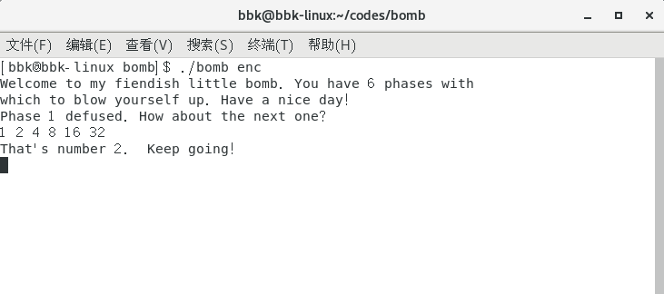

#### 3.3 第三关

和之前关卡一样，对`phase_3`函数进行分析。

##### 3.31 phase_3函数

我们找到名为`phase_3`的函数进行分析：
```bash
0000000000400f43 <phase_3>:
  400f43:	48 83 ec 18          	sub    $0x18,%rsp
  400f47:	48 8d 4c 24 0c       	lea    0xc(%rsp),%rcx
  400f4c:	48 8d 54 24 08       	lea    0x8(%rsp),%rdx
  400f51:	be cf 25 40 00       	mov    $0x4025cf,%esi
  400f56:	b8 00 00 00 00       	mov    $0x0,%eax
  400f5b:	e8 90 fc ff ff       	callq  400bf0 <__isoc99_sscanf@plt>
  400f60:	83 f8 01             	cmp    $0x1,%eax
  400f63:	7f 05                	jg     400f6a <phase_3+0x27>
  400f65:	e8 d0 04 00 00       	callq  40143a <explode_bomb>
  400f6a:	83 7c 24 08 07       	cmpl   $0x7,0x8(%rsp)
  400f6f:	77 3c                	ja     400fad <phase_3+0x6a>
  400f71:	8b 44 24 08          	mov    0x8(%rsp),%eax
  400f75:	ff 24 c5 70 24 40 00 	jmpq   *0x402470(,%rax,8)
  400f7c:	b8 cf 00 00 00       	mov    $0xcf,%eax
  400f81:	eb 3b                	jmp    400fbe <phase_3+0x7b>
  400f83:	b8 c3 02 00 00       	mov    $0x2c3,%eax
  400f88:	eb 34                	jmp    400fbe <phase_3+0x7b>
  400f8a:	b8 00 01 00 00       	mov    $0x100,%eax
  400f8f:	eb 2d                	jmp    400fbe <phase_3+0x7b>
  400f91:	b8 85 01 00 00       	mov    $0x185,%eax
  400f96:	eb 26                	jmp    400fbe <phase_3+0x7b>
  400f98:	b8 ce 00 00 00       	mov    $0xce,%eax
  400f9d:	eb 1f                	jmp    400fbe <phase_3+0x7b>
  400f9f:	b8 aa 02 00 00       	mov    $0x2aa,%eax
  400fa4:	eb 18                	jmp    400fbe <phase_3+0x7b>
  400fa6:	b8 47 01 00 00       	mov    $0x147,%eax
  400fab:	eb 11                	jmp    400fbe <phase_3+0x7b>
  400fad:	e8 88 04 00 00       	callq  40143a <explode_bomb>
  400fb2:	b8 00 00 00 00       	mov    $0x0,%eax
  400fb7:	eb 05                	jmp    400fbe <phase_3+0x7b>
  400fb9:	b8 37 01 00 00       	mov    $0x137,%eax
  400fbe:	3b 44 24 0c          	cmp    0xc(%rsp),%eax
  400fc2:	74 05                	je     400fc9 <phase_3+0x86>
  400fc4:	e8 71 04 00 00       	callq  40143a <explode_bomb>
  400fc9:	48 83 c4 18          	add    $0x18,%rsp
  400fcd:	c3                   	retq   
```

对其分析，发现这个函数调用`sscanf`函数进行读取，我们所输入的字符串用于读取。该函数有大量跳向相同地址的跳转指令，且结构之类的与`switch`语句符合，因此判断该函数应该通过读取标签值和目标值来比较目标值与所给的值是否相同，且决定是否触发炸弹。

和上一关一样，`sscanf`函数中的格式字符串只有一个起始地址，所以我们必须要用调试器查清到底该传什么类型的值。
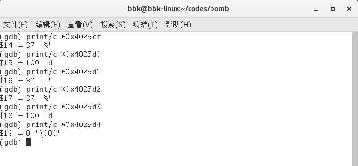

所以`phase_3`函数对应的C语言代码应该为：
```c
void phase_3(char *str)
{
    // 储存标签值以及目标值
    int int_vals[6];
    // 指向标签值的指针
    // 第2个写入
    int *val = &int_vals[2];
    // 指向目标值的指针
    // 第1个写入
    int *sel = &int_vals[3];
    // 读取的匹配格式的字符数量必须要大于1，标签值要小于8，
    // 且目标值要与对应标签中的值相同，否则触发炸弹
    // *0x4025cf
    if (sscanf(str, "%d %d", sel, val) > 1 && *sel <= 7)
    {
        int res;
        switch (*sel)
        {
            case 0:
                res = 207;
                break;
            case 2:
                res = 707;
                break;
            case 3:
                res = 256;
                break;
            case 4:
                res = 389;
                break;
            case 5:
                res = 206;
                break;
            case 6:
                res = 682;
                break;
            case 7:
                res = 327;
                break;
            default:
                res = 0;
                break;
            case 1:
                res = 311;
                break;
        }
        if (res != *val) explode_bomb();
    }
    else explode_bomb();
}
```

##### 3.32 第三关密码

综上，第三关的密码有多个，以下只列出其中一个，为
`0 207`

以下是通过第三关的提示：
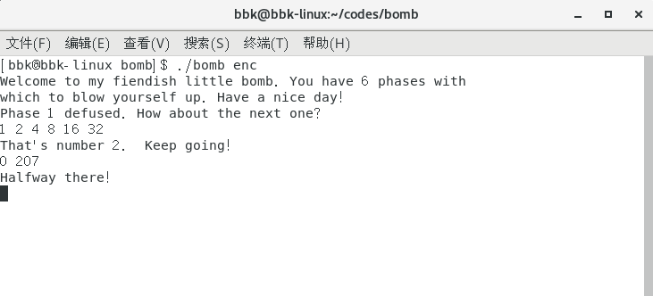

#### 3.4 第四关

和之前关卡一样，对`phase_4`函数进行分析。

##### 3.41 func4函数

我们对`phase_4`函数分析，发现其调用了一个名为`func4`的函数。

对`func4`函数进行分析，发现该函数应该有三个形参，第二和第三个形参的某种加减移位等操作后的数根据与第一个形参的逻辑关系来决定该返回什么整数。
该函数中存在递归调用。

```bash
0000000000400fce <func4>:
  400fce:	48 83 ec 08          	sub    $0x8,%rsp
  400fd2:	89 d0                	mov    %edx,%eax
  400fd4:	29 f0                	sub    %esi,%eax
  400fd6:	89 c1                	mov    %eax,%ecx
  400fd8:	c1 e9 1f             	shr    $0x1f,%ecx
  400fdb:	01 c8                	add    %ecx,%eax
  400fdd:	d1 f8                	sar    %eax
  400fdf:	8d 0c 30             	lea    (%rax,%rsi,1),%ecx
  400fe2:	39 f9                	cmp    %edi,%ecx
  400fe4:	7e 0c                	jle    400ff2 <func4+0x24>
  400fe6:	8d 51 ff             	lea    -0x1(%rcx),%edx
  400fe9:	e8 e0 ff ff ff       	callq  400fce <func4>
  400fee:	01 c0                	add    %eax,%eax
  400ff0:	eb 15                	jmp    401007 <func4+0x39>
  400ff2:	b8 00 00 00 00       	mov    $0x0,%eax
  400ff7:	39 f9                	cmp    %edi,%ecx
  400ff9:	7d 0c                	jge    401007 <func4+0x39>
  400ffb:	8d 71 01             	lea    0x1(%rcx),%esi
  400ffe:	e8 cb ff ff ff       	callq  400fce <func4>
  401003:	8d 44 00 01          	lea    0x1(%rax,%rax,1),%eax
  401007:	48 83 c4 08          	add    $0x8,%rsp
  40100b:	c3                   	retq   
```

所以`func4`函数对应的C语言代码应该为：
```c
int func4(int edi, int esi, int edx)
{
    // 第二和第三个形参的某种加减移位等操作
    // 当esi为0，edx为14时，结果值为7
    int res = edx - esi;
    res = (res + ((unsigned)res >> 31)) >> 1;
    int val = res + esi;
    // 相等返回0，否则进行递归调用判断
    if (val == edi)
        return 0;
    else if (val < edi)
        return func4(edi, val + 1, edx) * 2 + 1;
    else 
        return func4(edi, esi, val - 1) * 2;
}
```

##### 3.42 phase_4函数

对`phase_4`函数进行分析，发现其也是调用`sscanf`函数来读取数值的，且格式字符串与第三关的一样。
```bash
000000000040100c <phase_4>:
  40100c:	48 83 ec 18          	sub    $0x18,%rsp
  401010:	48 8d 4c 24 0c       	lea    0xc(%rsp),%rcx
  401015:	48 8d 54 24 08       	lea    0x8(%rsp),%rdx
  40101a:	be cf 25 40 00       	mov    $0x4025cf,%esi
  40101f:	b8 00 00 00 00       	mov    $0x0,%eax
  401024:	e8 c7 fb ff ff       	callq  400bf0 <__isoc99_sscanf@plt>
  401029:	83 f8 02             	cmp    $0x2,%eax
  40102c:	75 07                	jne    401035 <phase_4+0x29>
  40102e:	83 7c 24 08 0e       	cmpl   $0xe,0x8(%rsp)
  401033:	76 05                	jbe    40103a <phase_4+0x2e>
  401035:	e8 00 04 00 00       	callq  40143a <explode_bomb>
  40103a:	ba 0e 00 00 00       	mov    $0xe,%edx
  40103f:	be 00 00 00 00       	mov    $0x0,%esi
  401044:	8b 7c 24 08          	mov    0x8(%rsp),%edi
  401048:	e8 81 ff ff ff       	callq  400fce <func4>
  40104d:	85 c0                	test   %eax,%eax
  40104f:	75 07                	jne    401058 <phase_4+0x4c>
  401051:	83 7c 24 0c 00       	cmpl   $0x0,0xc(%rsp)
  401056:	74 05                	je     40105d <phase_4+0x51>
  401058:	e8 dd 03 00 00       	callq  40143a <explode_bomb>
  40105d:	48 83 c4 18          	add    $0x18,%rsp
  401061:	c3                   	retq   
```

所以`phase_4`函数对应的C语言代码应该为：
```c
void phase_4(char *str)
{
    // 储存值
    int int_vals[6];
    // 第2个写入
    int *rcx = &int_vals[2];
    // 第1个写入
    int *rdx = &int_vals[3];
    // 我们的输入值必须满足：
    // 读取的匹配格式的字符数量必须要等于2
    // 第1个写入的值要小于等于14且要使func4返回0
    // 第2个写入的值要等于0
    if (sscanf(str, "%d %d", rdx, rcx) != 2 || *rdx > 14 || func4(*rdx, 0, 14) != 0 || *rcx != 0)
        explode_bomb();
}
```

##### 3.43 第四关密码

综上，第四关的密码为
`7 0`

以下是通过第四关的提示：
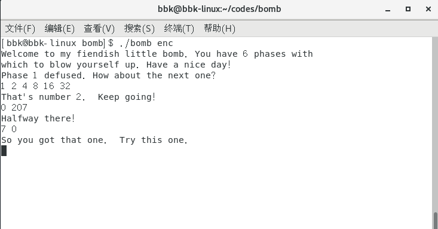

#### 3.5 第五关

和之前关卡一样，对`phase_5`函数进行分析。

##### 3.51 phase_5函数

对`phase_5`函数进行分析，发现该函数调用了`string_length`和`strings_not_equal`函数来操作。

```bash
0000000000401062 <phase_5>:
  401062:	53                   	push   %rbx
  401063:	48 83 ec 20          	sub    $0x20,%rsp
  401067:	48 89 fb             	mov    %rdi,%rbx
  40106a:	64 48 8b 04 25 28 00 	mov    %fs:0x28,%rax  #no use
  401071:	00 00 
  401073:	48 89 44 24 18       	mov    %rax,0x18(%rsp)  #no use
  401078:	31 c0                	xor    %eax,%eax  #%eax = 0
  40107a:	e8 9c 02 00 00       	callq  40131b <string_length>
  40107f:	83 f8 06             	cmp    $0x6,%eax
  401082:	74 4e                	je     4010d2 <phase_5+0x70>
  401084:	e8 b1 03 00 00       	callq  40143a <explode_bomb>
  401089:	eb 47                	jmp    4010d2 <phase_5+0x70>
  40108b:	0f b6 0c 03          	movzbl (%rbx,%rax,1),%ecx  #one char each time
  40108f:	88 0c 24             	mov    %cl,(%rsp)  #store one char
  401092:	48 8b 14 24          	mov    (%rsp),%rdx
  401096:	83 e2 0f             	and    $0xf,%edx  #only reserve the lowest 4 bits
  401099:	0f b6 92 b0 24 40 00 	movzbl 0x4024b0(%rdx),%edx  #*(0x4024b0+val)
  4010a0:	88 54 04 10          	mov    %dl,0x10(%rsp,%rax,1)  #store one char
  4010a4:	48 83 c0 01          	add    $0x1,%rax
  4010a8:	48 83 f8 06          	cmp    $0x6,%rax
  4010ac:	75 dd                	jne    40108b <phase_5+0x29>
  4010ae:	c6 44 24 16 00       	movb   $0x0,0x16(%rsp)  #add '\0' in end
  4010b3:	be 5e 24 40 00       	mov    $0x40245e,%esi
  4010b8:	48 8d 7c 24 10       	lea    0x10(%rsp),%rdi
  4010bd:	e8 76 02 00 00       	callq  401338 <strings_not_equal>
  4010c2:	85 c0                	test   %eax,%eax
  4010c4:	74 13                	je     4010d9 <phase_5+0x77>
  4010c6:	e8 6f 03 00 00       	callq  40143a <explode_bomb>
  4010cb:	0f 1f 44 00 00       	nopl   0x0(%rax,%rax,1)
  4010d0:	eb 07                	jmp    4010d9 <phase_5+0x77>
  4010d2:	b8 00 00 00 00       	mov    $0x0,%eax
  4010d7:	eb b2                	jmp    40108b <phase_5+0x29>
  4010d9:	48 8b 44 24 18       	mov    0x18(%rsp),%rax
  4010de:	64 48 33 04 25 28 00 	xor    %fs:0x28,%rax
  4010e5:	00 00 
  4010e7:	74 05                	je     4010ee <phase_5+0x8c>
  4010e9:	e8 42 fa ff ff       	callq  400b30 <__stack_chk_fail@plt>
  4010ee:	48 83 c4 20          	add    $0x20,%rsp
  4010f2:	5b                   	pop    %rbx
  4010f3:	c3                   	retq   
```

仔细分析，发现该函数的作用是：
让我们输入的字符串成为索引，通过引用该函数所给定的字符集合的某些字符来组合成一个和该函数所给字符串相同的字符串。

其中函数所给定的字符集合和字符串都只是显示了起始地址，和之前一样，需要查找这些字符串。
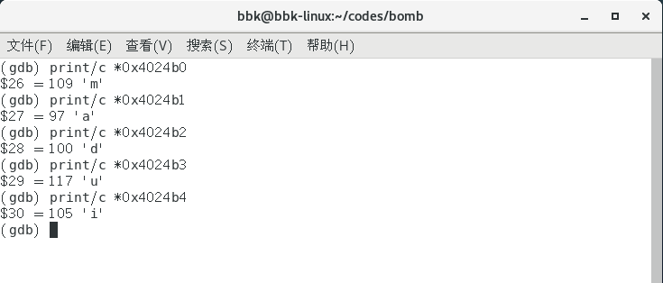
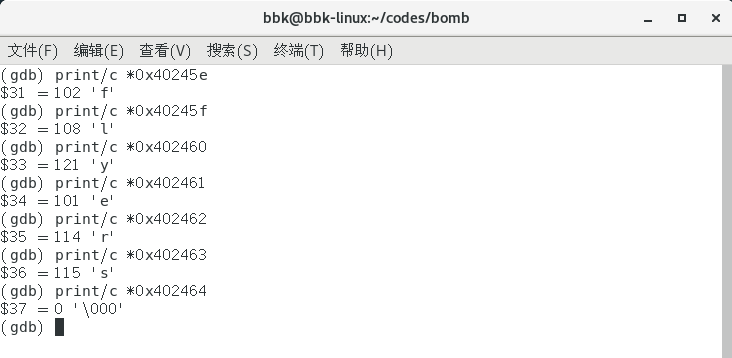

所以`phase_5`函数对应的C语言代码应该为：
```c
void phase_5(char *str)
{
    // 我们输入的密码长度必须为6(不包含空字符)，否则触发炸弹
    // 我们输入的字符串会被分成单独的字符，
    // 且每个字符只保留最低的4位，并将其转换成数值，用于表示函数所给定的字符集合的索引
    // 我们要通过给定的字符集合来组合成一个和所给字符串相同的字符串，否则触发炸弹
    if (string_length(str) == 6)
    {
        // 计数
        int count = 0;
        char decode[7];
        // 所给的字符集合
        // *0x4024b0
        // 所需的所有字符索引可以为以下这种组合：
        // 9 15 14 5 6 7
        char char_set[] = "maduiersnfotvbylSo you think you can stop the bomb with ctrl-c, do you?"; 
        // 给定的字符串，要与其相同
        // *0x40245e
        char code[] = "flyers";
        // 逐位组合成字符串
        do
        {
            int val = (int)(*(str+count) & 0x0f);
            decode[count] = char_set[val];
        }
        while (++count != 6);
        decode[6] = '\0';
        // 比较是否相同
        if (strings_not_equal(decode, code))
            explode_bomb();
    }
    else
        explode_bomb();
}
```

##### 3.52 第五关密码

综上，第五关的密码有多个，以下是其中的一个，为
`IONEFG`

以下是通过第五关的提示：
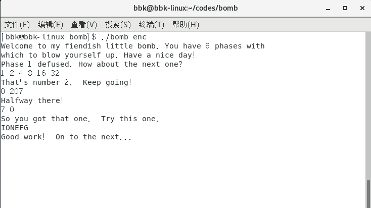

#### 3.6 第六关

和之前关卡一样，对`phase_6`函数进行分析。

##### 3.61 phase_6函数

对`phase_6`函数进行分析，发现该函数调用了`read_six_numbers`来操作。

```bash
00000000004010f4 <phase_6>:
  4010f4:	41 56                	push   %r14
  4010f6:	41 55                	push   %r13
  4010f8:	41 54                	push   %r12
  4010fa:	55                   	push   %rbp
  4010fb:	53                   	push   %rbx
  4010fc:	48 83 ec 50          	sub    $0x50,%rsp
  401100:	49 89 e5             	mov    %rsp,%r13  #&a
  401103:	48 89 e6             	mov    %rsp,%rsi
  401106:	e8 51 03 00 00       	callq  40145c <read_six_numbers>
  40110b:	49 89 e6             	mov    %rsp,%r14  #&a
  40110e:	41 bc 00 00 00 00    	mov    $0x0,%r12d  #0
  401114:	4c 89 ed             	mov    %r13,%rbp  #&a
  401117:	41 8b 45 00          	mov    0x0(%r13),%eax  #a
  40111b:	83 e8 01             	sub    $0x1,%eax  #a-1
  40111e:	83 f8 05             	cmp    $0x5,%eax  #a-1 <= 5
  401121:	76 05                	jbe    401128 <phase_6+0x34>
  401123:	e8 12 03 00 00       	callq  40143a <explode_bomb>
  401128:	41 83 c4 01          	add    $0x1,%r12d  #1
  40112c:	41 83 fc 06          	cmp    $0x6,%r12d  #%r12d == 6
  401130:	74 21                	je     401153 <phase_6+0x5f>
  401132:	44 89 e3             	mov    %r12d,%ebx  #1
  401135:	48 63 c3             	movslq %ebx,%rax  #%ebx 1 -> ...
  401138:	8b 04 84             	mov    (%rsp,%rax,4),%eax  #%eax b -> c -> d -> e -> f
  40113b:	39 45 00             	cmp    %eax,0x0(%rbp)  #a/b/... != %eax
  40113e:	75 05                	jne    401145 <phase_6+0x51>
  401140:	e8 f5 02 00 00       	callq  40143a <explode_bomb>
  401145:	83 c3 01             	add    $0x1,%ebx  #%ebx 2 -> ...
  401148:	83 fb 05             	cmp    $0x5,%ebx  #%ebx <= 5
  40114b:	7e e8                	jle    401135 <phase_6+0x41>
  40114d:	49 83 c5 04          	add    $0x4,%r13  #%r13 &b -> &c -> ...
  401151:	eb c1                	jmp    401114 <phase_6+0x20>
  401153:	48 8d 74 24 18       	lea    0x18(%rsp),%rsi  #%rsp+24 after &f
  401158:	4c 89 f0             	mov    %r14,%rax  #&a
  40115b:	b9 07 00 00 00       	mov    $0x7,%ecx  #7
  401160:	89 ca                	mov    %ecx,%edx  #7
  401162:	2b 10                	sub    (%rax),%edx  #7 - a/b/...
  401164:	89 10                	mov    %edx,(%rax)  #store in each a/b/...
  401166:	48 83 c0 04          	add    $0x4,%rax  #b -> c -> d -> e -> f
  40116a:	48 39 f0             	cmp    %rsi,%rax  #%rax != %rsp+24
  40116d:	75 f1                	jne    401160 <phase_6+0x6c>
  40116f:	be 00 00 00 00       	mov    $0x0,%esi
  401174:	eb 21                	jmp    401197 <phase_6+0xa3>
  401176:	48 8b 52 08          	mov    0x8(%rdx),%rdx
  40117a:	83 c0 01             	add    $0x1,%eax
  40117d:	39 c8                	cmp    %ecx,%eax
  40117f:	75 f5                	jne    401176 <phase_6+0x82>
  401181:	eb 05                	jmp    401188 <phase_6+0x94>
  401183:	ba d0 32 60 00       	mov    $0x6032d0,%edx
  401188:	48 89 54 74 20       	mov    %rdx,0x20(%rsp,%rsi,2)  #*(%rsp+%rsi*2+32) = 0x6032d0
  40118d:	48 83 c6 04          	add    $0x4,%rsi  #%rsi+4 4 -> ...
  401191:	48 83 fe 18          	cmp    $0x18,%rsi  #%rsi == 24
  401195:	74 14                	je     4011ab <phase_6+0xb7>
  401197:	8b 0c 34             	mov    (%rsp,%rsi,1),%ecx  #a/b/...
  40119a:	83 f9 01             	cmp    $0x1,%ecx  #a/b/... <= 1
  40119d:	7e e4                	jle    401183 <phase_6+0x8f>
  40119f:	b8 01 00 00 00       	mov    $0x1,%eax
  4011a4:	ba d0 32 60 00       	mov    $0x6032d0,%edx
  4011a9:	eb cb                	jmp    401176 <phase_6+0x82>
  4011ab:	48 8b 5c 24 20       	mov    0x20(%rsp),%rbx  #*(%rsp+32)
  4011b0:	48 8d 44 24 28       	lea    0x28(%rsp),%rax  #%rsp+40
  4011b5:	48 8d 74 24 50       	lea    0x50(%rsp),%rsi  #%rsp+80
  4011ba:	48 89 d9             	mov    %rbx,%rcx  #*(%rsp+32)
  4011bd:	48 8b 10             	mov    (%rax),%rdx  #*(%rsp+40)
  4011c0:	48 89 51 08          	mov    %rdx,0x8(%rcx)  #*(*(%rsp+32)+8)=*(%rsp+40)
  4011c4:	48 83 c0 08          	add    $0x8,%rax  #%rsp+80+8
  4011c8:	48 39 f0             	cmp    %rsi,%rax  #%rax == %rsp+80
  4011cb:	74 05                	je     4011d2 <phase_6+0xde>
  4011cd:	48 89 d1             	mov    %rdx,%rcx
  4011d0:	eb eb                	jmp    4011bd <phase_6+0xc9>
  4011d2:	48 c7 42 08 00 00 00 	movq   $0x0,0x8(%rdx)
  4011d9:	00 
  4011da:	bd 05 00 00 00       	mov    $0x5,%ebp
  4011df:	48 8b 43 08          	mov    0x8(%rbx),%rax
  4011e3:	8b 00                	mov    (%rax),%eax
  4011e5:	39 03                	cmp    %eax,(%rbx)
  4011e7:	7d 05                	jge    4011ee <phase_6+0xfa>
  4011e9:	e8 4c 02 00 00       	callq  40143a <explode_bomb>
  4011ee:	48 8b 5b 08          	mov    0x8(%rbx),%rbx
  4011f2:	83 ed 01             	sub    $0x1,%ebp
  4011f5:	75 e8                	jne    4011df <phase_6+0xeb>
  4011f7:	48 83 c4 50          	add    $0x50,%rsp
  4011fb:	5b                   	pop    %rbx
  4011fc:	5d                   	pop    %rbp
  4011fd:	41 5c                	pop    %r12
  4011ff:	41 5d                	pop    %r13
  401201:	41 5e                	pop    %r14
  401203:	c3                   	retq   
```

仔细分析，发现该函数的作用是：
通过我们输入的字符串来读取6个整数，然后使用这些整数的值的某种变形和该函数所给定的链表，来组成一个节点值按降序排列的链表。

其中函数所给定的所给定的链表只显示了首节点的地址，和之前一样，需要查找这些节点的值以及其所连的下一个节点：
* 下一个节点的地址是上一个节点地址加8的解引用。
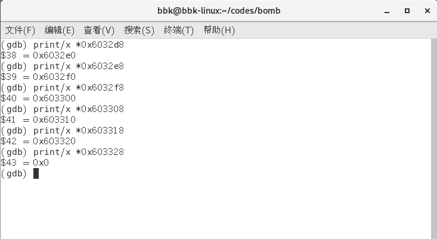
* 每个节点的值就是该节点地址的解引用。
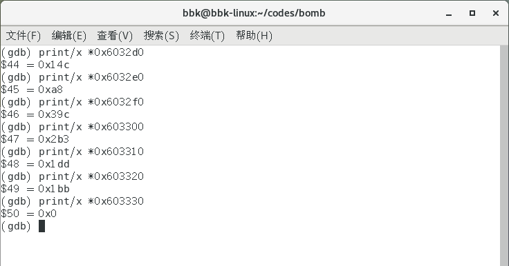

以下是该函数所给的链表的各节点的地址与值：
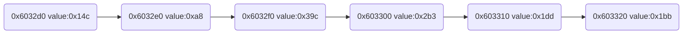

所以`phase_6`函数对应的C语言代码应该为：
```c
void phase_6(char *str)
{
    // 储存函数所给的链表的节点的地址
    int* ptrs[6];
    // 储存读取的整数
    int int_vals[8];
    int* vals_top = &int_vals[7];
    int** ptrs_top = &ptrs[5];
    // 进行6个整数的读取
    read_six_numbers(str, vals_top);

    // 我们所读取的所有整数都要满足以下条件，否则触发炸弹
    // 所有的值要大于0，小于7
    // 所有的整数之间不能有相同的
    int* num_iter = vals_top;
    int count = 0;
    do
    {
        // 检查值是否大于0，小于7
        if (*num_iter - 1 <= 5)
        {
            // 逐个检查每个整数
            if (++count != 6)
            {
                int inner_count = count;
                // 检查整数之间是否有重复的
                do
                    if (*num_iter == *(vals_top - inner_count))
                        explode_bomb();
                while (++inner_count <= 5);
                num_iter -= 1;
            }
        }
        else
            explode_bomb();
    }
    while (count != 6);

    // 每个整数的值都会变成其值减7的相反数的值
    int *num_iter2 = vals_top;
    do
        *num_iter2 = 7 - *num_iter2;
    while (++num_iter2 != vals_top - 6);

    // 根据该函数所给的链表地址和之前整数的值
    // 对链表的某些节点地址进行储存
    // 储存6个节点的地址
    int *iter_num = vals_top;
    // 该函数所给的链表起始地址，也就是首节点的地址
    int spec_val = 0x6032d0;
    int count2 = 0;
    // 根据之前的整数值，选择所要储存的节点地址
    // 整数值为1则储存第一个节点的地址，2为第二个，以此类推
    while (*iter_num <= 1 || count2 != 6)
    {
        // 根据整数值选择节点地址
        if (*iter_num > 1)
        {
            spec_val = *(int*)(0x6032d0+8);
            for (int count = 2; count != *iter_num; ++count)
                spec_val = *(int*)(spec_val+8);
        }
        else
            spec_val = 0x6032d0;
        // 从指针数组的末尾到开头的顺序逐个储存节点地址
        *(ptrs_top - count2) = (int*)spec_val;
        // 当指针数组全都储存完毕后，退出储存
        if (++count2 == 6)
            break;
        // 逐个选择整数值
        iter_num = vals_top - count2;
    }

    // 使指针数组里所储存的各个节点按从末尾到开头的顺序连接起来，形成一个新的链表。
    int* rsp_32 = *ptrs_top;
    int** iter_ptr = ptrs_top - 1;
    int* temp_ptr = rsp_32;
    do
    {
        // 使数组的后一个元素指向数组的前一个元素。
        *(temp_ptr + 1) = (int)*iter_ptr;
        temp_ptr = *iter_ptr;
        iter_ptr -= 1;
    }
    while (iter_ptr != ptrs_top - 6);
    // 形成尾节点
    *iter_ptr = 0;

    // 从首节点向尾节点进行检查，前一节点的值必须要大于或等于后一节点的值
    // 也就是节点值按降序排列。
    int count3 = 5;
    do
    {
        if (*rsp_32 < *((int*)*(rsp_32 + 1)))
            explode_bomb();
        rsp_32 = (int*)*(rsp_32 + 1);
    }
    while (--count3 != 0);
}
```

##### 3.62 第六关密码

综上，第六关的密码为
`4 3 2 1 6 5`

以下是通过第六关的提示：
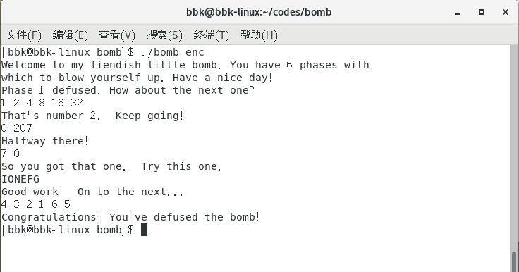

我们在破解完第六关的密码后，程序就已经显示我们成功拆除了炸弹，并且程序也正常终止。
这也就证明了我们已经成功完成了拆弹任务，我们可以收工回家咯！

> 炸弹真的拆除了吗&#x2753;&#x1F608;

#### 3.7 彩蛋关

欢迎来到隐藏关卡！
其实这个程序还有一个隐藏的关卡，不过通不通过隐藏关并不会影响正常的流程，这个只是一个额外的关卡。

细心的同学在破解的过程中会发现，程序的汇编代码中含有一个叫做`secret_phase`的函数，该函数也是让我们输入字符并决定是否引爆炸弹，这个函数也就是这个隐藏关所要破解的函数。

> 炸弹制作者——邪恶博士也在他的`bomb.c`文件中暗示过隐藏关的存在。
> 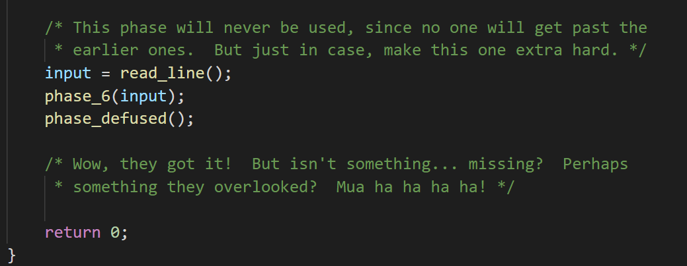

现在，就让我们来破解隐藏关的密码！

##### 3.71 fun7函数

我们对`secret_phase`函数分析，发现其调用了一个名为`fun7`的函数。

对`fun7`函数进行分析，发现该函数应该有两个形参，第一个形参应该为int指针，表示某二叉数的根节点；第二个形参应该为int型。
该函数中存在递归调用。

```bash
0000000000401204 <fun7>:
  401204:	48 83 ec 08          	sub    $0x8,%rsp
  401208:	48 85 ff             	test   %rdi,%rdi
  40120b:	74 2b                	je     401238 <fun7+0x34>
  40120d:	8b 17                	mov    (%rdi),%edx
  40120f:	39 f2                	cmp    %esi,%edx
  401211:	7e 0d                	jle    401220 <fun7+0x1c>
  401213:	48 8b 7f 08          	mov    0x8(%rdi),%rdi
  401217:	e8 e8 ff ff ff       	callq  401204 <fun7>
  40121c:	01 c0                	add    %eax,%eax
  40121e:	eb 1d                	jmp    40123d <fun7+0x39>
  401220:	b8 00 00 00 00       	mov    $0x0,%eax
  401225:	39 f2                	cmp    %esi,%edx
  401227:	74 14                	je     40123d <fun7+0x39>
  401229:	48 8b 7f 10          	mov    0x10(%rdi),%rdi
  40122d:	e8 d2 ff ff ff       	callq  401204 <fun7>
  401232:	8d 44 00 01          	lea    0x1(%rax,%rax,1),%eax
  401236:	eb 05                	jmp    40123d <fun7+0x39>
  401238:	b8 ff ff ff ff       	mov    $0xffffffff,%eax
  40123d:	48 83 c4 08          	add    $0x8,%rsp
  401241:	c3                   	retq     
```

该函数的作用是：
用来查找所给的值是否存在于所给的二叉排序树中，并返回某种位置编号。

所以`fun7`函数对应的C语言代码应该为：
```c
// 该函数是用来查找所给的整数值是否存在于所给的二叉排序树中
// 并返回某种位置编号
int fun7(int* root, int val)
{
    // 当树为空时，返回-1
    if (root == NULL) 
        return -1;
    // 当val等于当前节点的值时，返回0
    // 当val大于当前节点的值时，进入右子节点继续查找
    else if (*root <= val)
    {
        if (*root == val)
            return 0;
        else
            return fun7((int*)*(root + 2), val) * 2 + 1;
    }
    // 当val小于当前节点的值时，进入左子节点继续查找
    else
        return fun7((int*)*(root + 1), val) * 2;
}
```

##### 3.72 secret_phase函数

对`secret_phase`函数进行分析。

```bash
0000000000401242 <secret_phase>:
  401242:	53                   	push   %rbx
  401243:	e8 56 02 00 00       	callq  40149e <read_line>
  401248:	ba 0a 00 00 00       	mov    $0xa,%edx
  40124d:	be 00 00 00 00       	mov    $0x0,%esi
  401252:	48 89 c7             	mov    %rax,%rdi
  401255:	e8 76 f9 ff ff       	callq  400bd0 <strtol@plt>
  40125a:	48 89 c3             	mov    %rax,%rbx
  40125d:	8d 40 ff             	lea    -0x1(%rax),%eax
  401260:	3d e8 03 00 00       	cmp    $0x3e8,%eax
  401265:	76 05                	jbe    40126c <secret_phase+0x2a>
  401267:	e8 ce 01 00 00       	callq  40143a <explode_bomb>
  40126c:	89 de                	mov    %ebx,%esi
  40126e:	bf f0 30 60 00       	mov    $0x6030f0,%edi
  401273:	e8 8c ff ff ff       	callq  401204 <fun7>
  401278:	83 f8 02             	cmp    $0x2,%eax
  40127b:	74 05                	je     401282 <secret_phase+0x40>
  40127d:	e8 b8 01 00 00       	callq  40143a <explode_bomb>
  401282:	bf 38 24 40 00       	mov    $0x402438,%edi
  401287:	e8 84 f8 ff ff       	callq  400b10 <puts@plt>
  40128c:	e8 33 03 00 00       	callq  4015c4 <phase_defused>
  401291:	5b                   	pop    %rbx
  401292:	c3                   	retq   
  401293:	90                   	nop
  401294:	90                   	nop
  401295:	90                   	nop
  401296:	90                   	nop
  401297:	90                   	nop
  401298:	90                   	nop
  401299:	90                   	nop
  40129a:	90                   	nop
  40129b:	90                   	nop
  40129c:	90                   	nop
  40129d:	90                   	nop
  40129e:	90                   	nop
  40129f:	90                   	nop
```

对`secret_phase`函数分析后，发现其调用`strtol`函数来将读取的字符串转换成整数；且该函数还调用`fun7`函数来判断转换后的值是否存在于所给的二叉排序树的特定位置。

其中函数所给的二叉排序树只显示了根节点的地址，和之前一样，需要查找这些节点的值以及其所连的左右子节点：
* 左子节点的地址是该节点的地址加8的解引用。
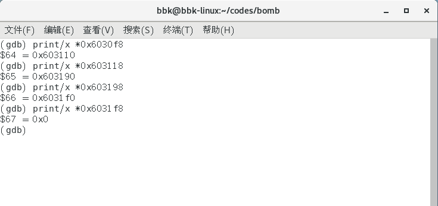
* 右子节点的地址是该节点的地址加16的解引用。
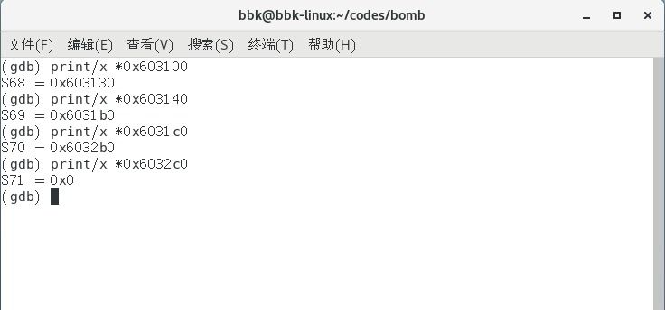
* 每个节点的值就是该节点地址的解引用。
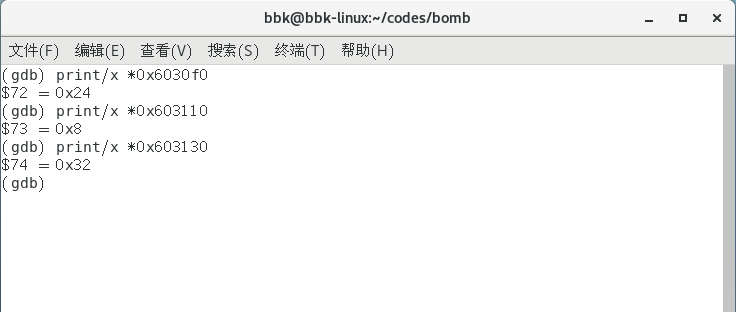

以下是该函数所给的二叉排序树的各节点的地址与值：
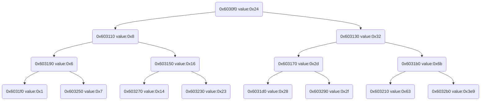

所以`secret_phase`函数对应的C语言代码应该为：
```c
void secret_phase(char *str)
{
    // 该函数将我们输入的字符串转换成整数
    // 该整数必须小于等于1001，且该整数值必须要使fun7返回2，否则触发炸弹
    // 0x6030f0是所给的二叉排序树的根节点的地址
    unsigned int val = strtol(str, NULL, 10);
    if (val - 1 > 1000 || fun7((int*)0x6030f0, val) != 2)
        explode_bomb();
}
```

##### 3.73 彩蛋关密码

综上，彩蛋关的密码为
`22`

以下是通过彩蛋关的提示：


现在我们才真正的破解了炸弹的所有密码，真正的拆除了炸弹，此时，实验才是真正的圆满完成！&#x1F600;

### 4.总结

这个实验的难度对于我来说还是非常大的，因为之前并没有学习过汇编方面的知识，所以面对汇编代码时看的很痛苦，尤其是第6关的函数，各种跳转指令夹杂在一起，看的异常的头痛！

对于汇编语言来说，就和其他的高级语言一样，多练习，多翻译，这样就能有很大的进步！
