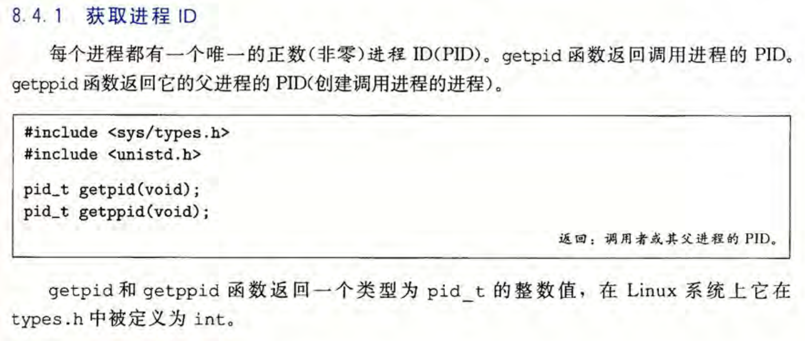

## Shell Lab实验解答

### 1.实验概述

> 注意：Shell Lab实验需要用到CSAPP_3th第八章的关于进程与信号控制方面的内容和基本的C语言语法知识。
> 所以实验之前需要掌握第八章和C语言语法的知识。

本次实验的内容是让我们了解处理器与操作系统之间的逻辑控制设计，并能够明白进程控制的原理流程，以便能够利用进程方面的知识对程序进行分析。

这次实验只有一关，该关要求我们设计出一个像Linux的Shell程序一样的shell简化版本，并实现其中的一些简单功能。

实验还提供了每一关对应的示例与测试等工具。

### 2.实验准备

本次实验所包含的文档`shlab.pdf`以及文件夹中的`README`文档详细介绍了每一关所需要进行的步骤、完成的目标和附带工具的使用方法，以供我们参考。
我们所用的机器需要有C语言环境，以便对我们写的C语言代码进行编译链接等操作。

### 3.进行实验

本次实验主要是对CSAPP_3th第八章所涉及的进程与信号控制方面的相关知识的运用。

**实验相关知识**

在进行实验之前，我们需要了解linux的进程与信号控制方面的C语言系统级函数，以下是书中有关这些系统级函数的一些原型：

#### 3.1 第一关

##### 3.11 任务要求

第一关所需的所有工具文件在`shlab-handout/`目录下。

本关给我们一个Shell示例程序`tshref`，该程序是一个简单版本的Shell程序，可以用于加载可执行文件和使用一些内置指令。

以下为示例程序`tshref`的操作参数：

我们需要在文件`tsh.c`中模仿该程序写出一个操作逻辑相同，输出结果也相同的Shell程序，并通过测试才算完成该关。
不过我们不需要从零开始做出来一个Shell程序，在文件`tsh.c`中已经完成了大部分的函数，我们只需要完成其中几个主要的逻辑函数的实现就行，我们需要完成以下7个函数的实现：

我们在编写完文件`tsh.c`后，在目录为`shlab-handout/`的命令行下输入`make`来自动编译程序，然后接着输入`make test01`、`make test02`、`make test03`直到`make test16`来分别测试我们所制作的shell程序的各方面，我们需要与文件`tshref.out`中列的所有示例程序`tshref`的测试输出结果全部相同才能满分（当然除了进程PID和用指令ps输出的结果可以不一样，不过还是要符合输出逻辑）。

##### 3.12 任务解答

我们打开文件`tsh.c`发现每个函数都有注释，我们首先需要根据这些注释来了解里面的设计逻辑。

通过阅读注释和代码，我们可以分析出我们所要实现函数的作用：
1. 函数`eval`：
   程序主要通过函数`eval`来判断所输入的命令行指令是否为内置指令来进行不同的操作，如果是内置指令，则直接执行该指令，否则创建一个子进程来执行该程序指令。
    且如果命令行末尾有符号`&`，则将该进程放入后台，默认创建的进程为前台，如果有任何进程在前台，则程序必须要等待没有进程不为前台才能继续接收命令行输入。
2. 函数`builtin_cmd`：
   用于执行各种内置指令，根据命令行的参数选择对应内置指令来进行。
3. 函数`do_bgfg`：
   用于执行内置指令`bg`和`fg`，根据命令行的参数选择对应`job`（作业）来将其放入前台或后台。
4. 函数`waitfg`：
   用于等待前台指令，挂起调用进程直到给定前台指令结束。
5. 函数`sigchld_handler`、`sigint_handler`和`sigtstp_handler`：
   三个信号处理函数，分别接受信号`SIGCHLD`、`SIGINT`和`SIGTSTP`（来自终端的停止信号），并进行对应的进程处理。
   函数`sigint_handler`和`sigtstp_handler`只用于处理前台进程，输出相应提示，并及时更新该进程的状态；函数`sigchld_handler`主要用于检测已被停止和终止的子进程，并回收其中的被终止的子进程，且输出相应提示。
6. 辅助函数：
    文件`tsh.c`中提供了一些有用的函数，方便我们函数的实现，比如有`parseline`函数来提取命令行信息，函数`addjob`和`deletejob`用于增删作业，函数`getjobpid`和`getjobjid`用于查找作业等。

通过对这些函数的分析，我们可以大概知道这7个函数该如何实现的了，我实现的具体代码在目录`shlab-handout/`下的文件`tsh.c`中，大家可以自行观看。

以下是该代码编译出的Shell程序测试通过的界面（满分）：

### 4.总结

本次实验让我们深入地了解了计算机进程控制方面的知识，也了解了shell程序的实现逻辑，通过这次实验，我们在以后的编写代码时能够从进程方面分析程序，从而写出更加健壮的程序。
