## Malloc Lab实验解答

### 1.实验概述

> 注意：Malloc Lab实验需要用到CSAPP_3th第九章的关于虚拟内存和动态内存分配方面的内容和基本的C语言语法知识。
> 所以实验之前需要掌握第九章和C语言语法的知识。

本次实验的内容是让我们了解虚拟内存的作用和明白动态内存分配设计的原理和流程，以便在进行程序设计时能够从内存分配方面进行分析和处理。

这次实验只有一关，该关要求我们设计出一个像Linux的C语言标准库提供的一些内存分配函数，如函数`malloc`一样的具有动态内存分配功能的函数。

实验还提供了每一关对应的示例与测试等工具。

### 2.实验准备

本次实验所包含的文档`malloclab.pdf`以及文件夹中的`README`文档详细介绍了每一关所需要进行的步骤、完成的目标和附带工具的使用方法，以供我们参考。
我们所用的机器需要有C语言环境，以便对我们写的C语言代码进行编译链接等操作。

### 3.进行实验

本次实验主要是对CSAPP_3th第九章所涉及的动态内存分配方面的相关知识的运用。

**实验相关知识**

在进行实验之前，我们需要了解Linux的通用内存分配函数的基本设计，以下是书中对于有关这些函数设计流程的简单介绍：
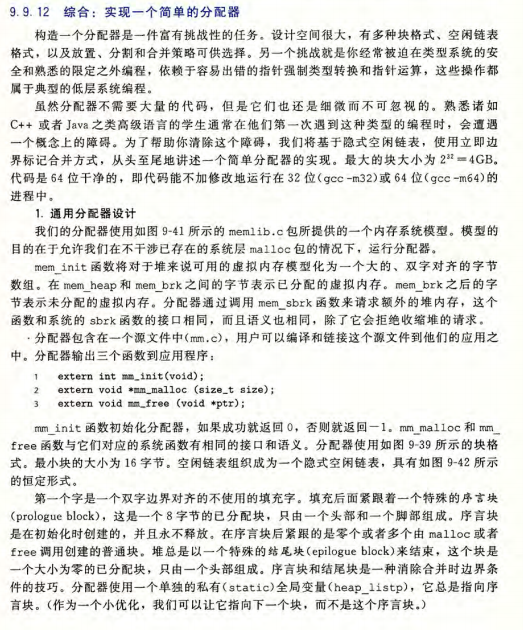
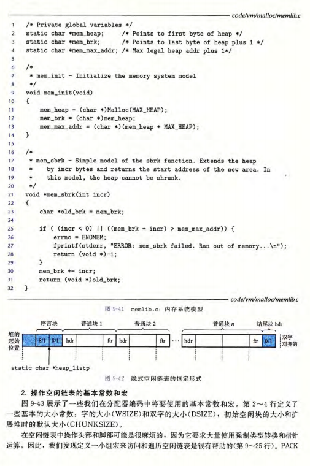
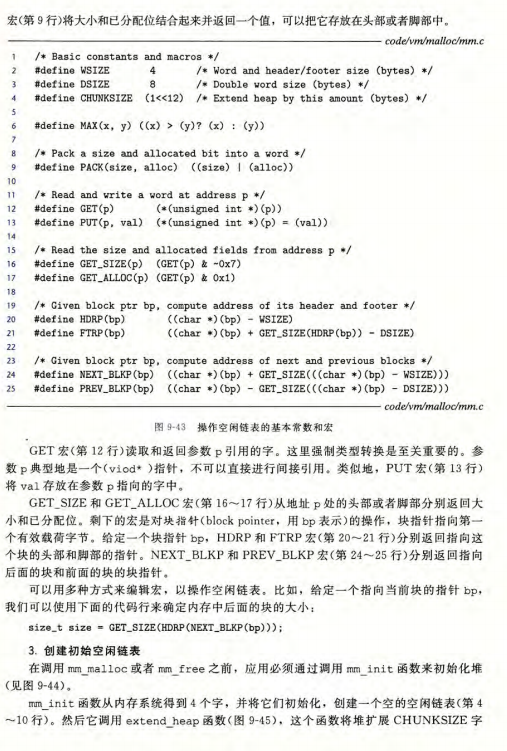
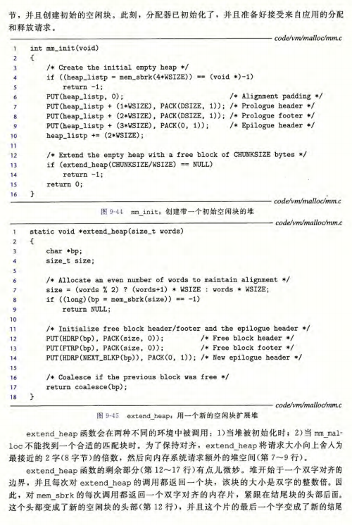
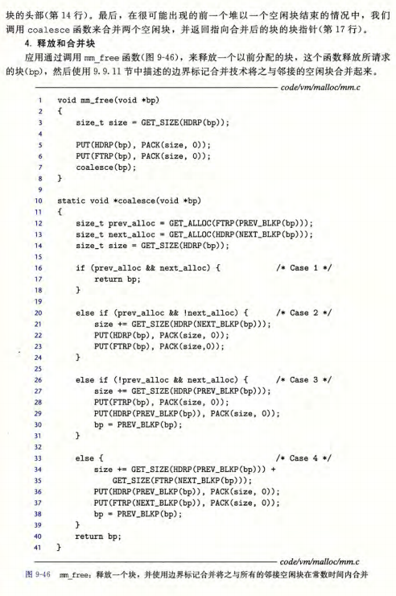

#### 3.1 第一关

##### 3.11 任务要求

第一关所需的所有工具文件在`malloclab-handout/`目录下。

本关让我们模仿Linux的C语言标准库提供的malloc函数等内存分配相关的函数，来实现自己的一些内存分配相关函数。

我们需要在文件`mm.c`中实现以下4个内存分配相关的函数：
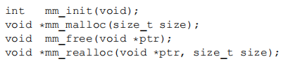
以下是这四个函数的要求：
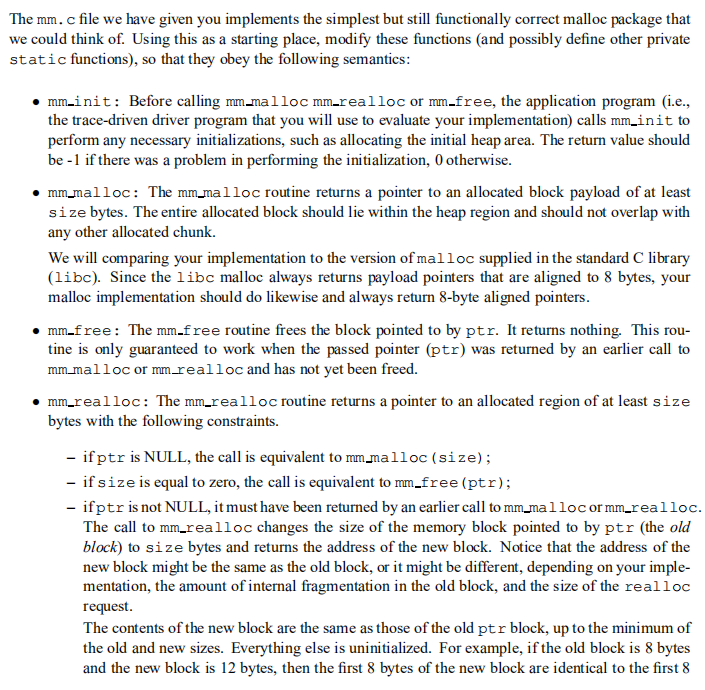
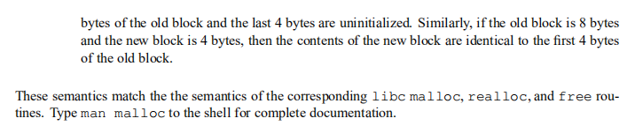

实验还在文件`memlib.h`中（该文件已被文件`mm.c`包含）提供了一些辅助函数，帮助我们实现内存分配相关的函数。
以下是这些辅助函数的说明：
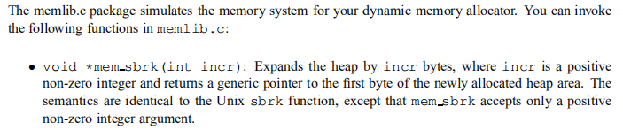
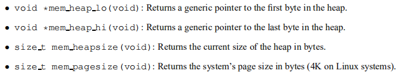

> 该关要求：
> 1. 不能修改这4个函数的接口。
> 2. 不能使用任何C语言标准库提供的有关内存分配的函数，只能使用辅助函数。
> 3. 不能定义全局或者静态的数组，结构体，树和列表等数据结构，只能定义标量变量。
> 4. 实现的内存分配功能要满足8字节对齐的要求。

在文件`mm.c`中完成之前提到的4个内存分配相关的函数后，我们要在目录为`malloclab-handout/`的命令行下输入`make`来自动编译程序，然后接着输入`./mdriver -V -f short1-bal.rep`和`./mdriver -V -f short2-bal.rep`来分别测试我们所制作的程序的正确性和相关性能（如空间利用率和吞吐量），我们需要在这些测试中全部正确且性能分数达到60以上才算通过，且如果我们编写了堆一致性检查器，会有额外加分。
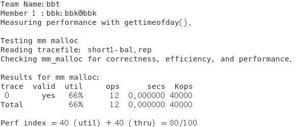

##### 3.12 任务解答

我们打开文件`mm.c`发现每个函数都有相关注释，我们就根据注释和函数要求来一一实现这4个函数。

通过对这些函数注释和要求的分析，我们可以发现这4个函数的实现和书中所讲到的通用内存分配函数的实现是基本一致的，所以我们可以参考书中的代码来实现我们自己的通用内存分配函数。

我实现的具体代码在目录`malloclab-handout/`下的文件`mm.c`中，大家可以自行观看。

以下是该代码编译出的内存分配程序测试通过的界面：
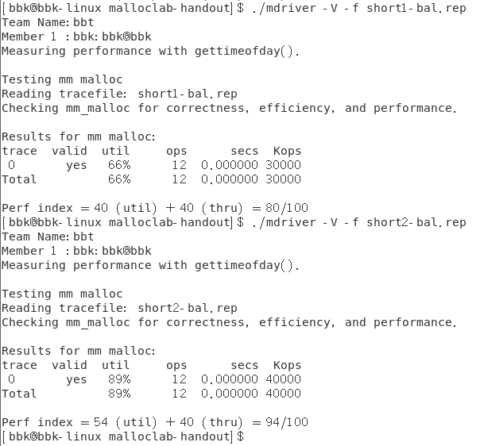

### 4.总结

本次实验让我们深入地了解了虚拟内存和动态内存分配方面的知识，也了解了有关动态内存分配器实现的原理与步骤，通过这次实验，我们在以后的编写代码时能够从虚拟内存方面分析程序，能够更加正确的使用动态内存，从而写出更加健壮的程序。
