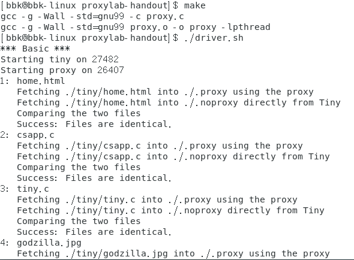
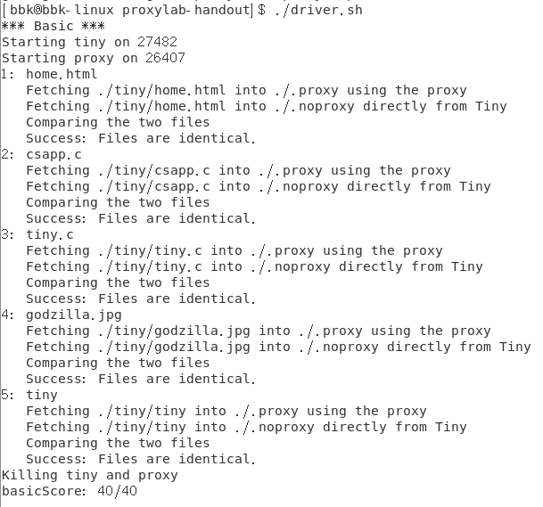

## Proxy Lab实验解答

### 1.实验概述

注意：Proxy Lab实验是CSAPP_3th一书的最后一个实验，该实验需要多章的知识来进行，主要用到章节有：
1. 第8章的信号控制
2. 第9章的动态内存分配
3. 第10章的文件描述符和系统读写函数
4. 第11章的套接字接口和Web服务器
5. 第12章的并发编程
6. 最后需要C语言的相关语法知识。

本次实验的内容是让我们复习和运用多章的知识，尤其是网络、IO和并发编程方面的知识，以便在以后的程序设计中能在多角度多方面设计和分析程序，写出更加健壮优秀的程序。

这次实验有三关，不过这三关都是对一个程序进行设计，每一关要求实现该程序的某部分功能。
这次实验要求功能简单但健壮的HTTP代理程序，该代理程序能够同时接收多个客户端发送的代理请求，并将这些请求发送到真正所需的服务器中，最后将这些服务器的响应数据传回到对应的客户端，实现完整的代理流程。

实验还提供了每一关对应的示例与测试等工具。

### 2.实验准备

本次实验所包含的文档`proxylab.pdf`以及文件夹中的`README`文档详细介绍了每一关所需要进行的步骤、完成的目标和附带工具的使用方法，以供我们参考。
我们所用的机器需要有C语言环境，以便对我们写的C语言代码进行编译链接等操作。

### 3.进行实验

本次实验需要结合多章的相关知识进行运用。

**实验相关知识**

在进行实验之前，我们需要了解常用的IO、网络和并发编程方面的系统级函数：

#### 3.1 第一关

##### 3.11 任务要求

第一关所需的所有工具文件在`proxylab-handout/`目录下。

本关让我们先实现代理程序的基本代理流程。

本关的要求有以下几点：
1. 可以接收类似`GET http://www.cmu.edu/hub/index.html HTTP/1.1`或者`GET /hub/index.html HTTP/1.0`的请求行，并可以对请求行进行语法分析，提取出相关的信息。并把收到的HTTP服务版本改为`1.0`。
2. 在转发请求时要加上给定的4个请求报头：`Host, User-Agent: Mozilla/5.0 (X11; Linux x86_64; rv:10.0.3) Gecko/20120305 Firefox/10.0.3, Connection: close, Proxy-Connection: close`，如果接收的请求有Host报头，那么就用接收的Host报头，而对于其他3个报头则用规定的报头。如果接收到了其他非该4个中的报头，则将其直接进行转发。
3. 设计的代理程序所监听的端口需要用命令行参数来提供，而转发服务器的连接端口如果转发请求提供了，则用提供的，否则就用固定的`80`端口。
4. 设计的代理程序需要能对某些信号作出反应并防止其自动停止程序的运行，如`STGPIPE`信号。

我们需要在文件`proxy.c`和`proxy.h`中实现该代理程序，之后的几关也是在这些文件中实现，我们还可以添加自己写的其他头文件和C文件来共同实现。
实验还在文件`csapp.h`和`csapp.c`中提供了一些辅助函数，帮助我们实现代理程序。

在完成了程序的设计后，我们要在目录为`malloclab-handout/`的命令行下输入`make`来自动编译程序（如果添加了自己的文件，则要在`Makefile`文件中添加修改编译文件），然后接着输入`./driver`来进行测试，该测试是三关共用的测试工具，每关都有对应的测试和评分，分别测试我们所制作的程序的正确性和相关性能。

##### 3.12 任务解答

我们打开文件`proxy.c`和`proxy.h`发现并没有提供基础的函数，这次代理程序的设计需要我们全程自己设计。

我们可以回顾一下代理程序的代理流程：
代理程序接收客户端发送的代理请求，并将这些请求发送到真正所需的服务器中，最后将这些服务器的响应数据传回到对应的客户端。

所以对于代理程序的基本设计，就可以分为三部分：
1. 接收并分析客户端发送的代理请求。
    对于这部分，我们需要知道HTTP请求的格式并能正确接收到代理请求，然后在这些信息中提取到相关信息，这过程需要建立监听并对请求信息进行分割分析。
2. 将接收到的代理请求进行处理。
    这部分需要我们整理接收到的请求消息和提取的消息，并把这些消息安排在一起，使之后能够转发正常的请求，这过程需要将信息组合成一个大的数据串或者组。
1. 将处理完成的HTTP请求发送给服务器，接收服务器发送的响应数据并传回到客户端。
    最后一部分需要我们将整合的请求消息转发给我们需要发送的对应服务器，并将对应服务器的响应数据在转发回之前的客户端，这过程需要对服务器建立连接和使用IO函数发送并接收数据。

通过以上这三部分我们就可以设计出一个基本但完整的代理流程的程序。本人该部分的代码主要在文件夹中的文件`proxy.h`、`proxy.c`和`usefulFunc.h`中

以下是该部分设计通过测试的界面(满分)：

#### 3.2 第二关

##### 3.21 任务要求

第二关所需的所有工具文件也在`proxylab-handout/`目录下。

本关让我们实现代理程序的并发处理，使该代理程序能够同时处理多个客户端的代理请求。

##### 3.22 任务解答

该关让我们实现代理程序的并发功能，对于并发编程来说，主要有三种实现方式：
1. 基于进程的并发编程：
   基于进程的实现方式目前是无法设计的，由于CSAPP_3th一书没有提到如何进行IPC通信(进程间通信)，且对于该实验，我们必须要能够共享文件描述符表才能实现多进程处理不同的代理请求(也就是之前创建的子进程能够正常使用后续其他进程连接上的套接字)，但目前来说，进程的虚拟地址空间等结构都是独立的，无法进行共享。
2. 基于IO多路复用的并发编程：
   基于IO多路复用的实现方式，虽然可以使用，但这种实现方式是只有一个进程/线程在多个描述符之间快速切换的并发编程，容易受到某些恶意客户端的堵塞干扰而导致后续的代理请求无法处理。
3. 基于线程的并发编程
    基于线程的实现方式是目前最流行也是最常见的，虽然上下文切换的时间消耗相比IO多路复用大，但是使用简单，操作简便，所以推荐使用基于线程来实现代理程序的并发。

我所采用的是基于线程的实现，所以需要考虑到线程同步的问题，可以使用信号量来实现信息同步和共享资源的调度。本人使用了一个书上提到的`生产者-消费者`的共享资源调度的队列结构来管理并发请求。

这关的代码主要在文件夹中的文件`fdsQueue.h`中。

以下是该部分设计通过测试的界面(满分)：

#### 3.3 第三关

##### 3.31 任务要求

第三关所需的所有工具文件也都在`proxylab-handout/`目录下。

本关让我们根据上一关实现的并发代理程序，加入数据缓存的功能，能够在接收到服务器的响应数据后，将该数据缓存起来，使之后如果有相同的代理请求，能够不需要再次转发请求而直接将缓存的数据发给客户端，从而减少客户端的访问时间。

本关的要求有以下几点：
1. 规定了单个响应数据的缓存大小限制和总的缓存区限制。超过了单个大小限制甚至总缓存区大小限制的响应数据不能进行缓存。
2. 缓存区需要采取LRU策略来自动删除不常用的缓存数据，当缓存区没有空间对某响应数据(大小没有超出限制)进行存储时，缓存区需要删除最久使用的数据来保证能够存放该数据。
3. 缓存区需要是线程安全的，且能够接受多个线程同时对缓存区进行访问。

##### 3.32 任务解答

这最后一关就是让我们将之前第9章实现的动态内存分配器使用到代理程序中，并能够将响应数据进行存储和查找。

所以对于代理程序的缓存设计，可以分为两大部分：
1. 设计动态内存分配器，能够使用LRU策略动态的存储和删除数据
    对于这部分，我们可以参考之前第9章实现的动态内存分配器的相关设计来设计，不过第9章是用隐式空闲链表实现的，我们可以使用显式空闲链表进行实现来简化操作。
2. 设计数据查询结构，能够根据域名URI等相关请求信息查找到对应的数据，并与动态内存分配器结合起来。
    对于有多个相关信息的数据来说，必须要满足所有相关信息相等才算查询成功，我们要考虑这一点来设计查询结构。
    这部分我们可以使用经典的数组结构来存储相关请求信息，不过对于同一域名的不同URI等多个响应数据以及不同的域名的响应数据来说，使用数组查询效率太低，时间复杂度高。使用二叉树结构则需要相关信息能够进行比较，B+树则实现较复杂，散列表结构需要对相关信息进行编码并进行多级散射。综合考虑还是推荐使用多层链表来进行数据的索引，多层链表实现相对简单，空间需求小，且支持多个键的数据查找。

通过以上这两大部分我们就可以设计出代理程序的缓存功能了。本人该部分的代码主要在文件夹中的文件`multilayerLlist.h`、`cacheZone.h`和`cookieStruct.h`中

以下是该部分设计通过测试的界面(满分)：

### 4.总结

本次实验让我们对整本书的后半部分进行了全面的回顾，并深刻理解了计算机的IO、网络和并发方面的知识，通过这次实验，我们在以后的编写代码时能够从多方面考虑程序的设计和运行，能够更加使用所学的知识写出更加健壮的程序！